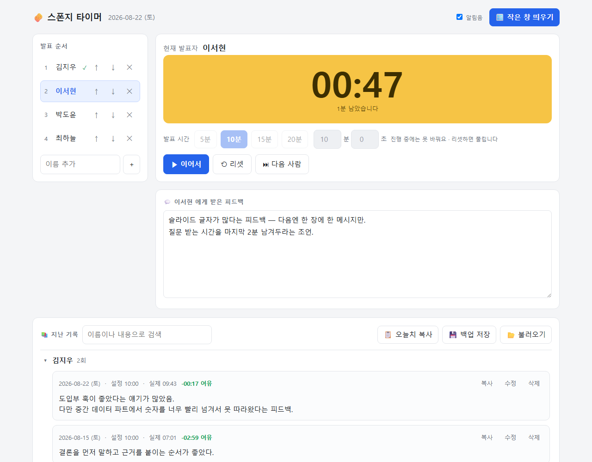
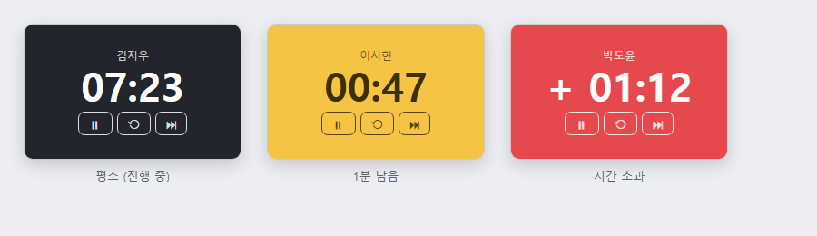

<!-- ⬆️ 위 --- 사이는 운영용 메모예요. 건드리지 말고 그대로 두세요. -->

# 디제이 자기소개 카드

- 닉네임: 디제이
- 하는 일: 재무관리 · 컨설팅

---

## 🙋 자기소개

### 1. MBTI

> ESTJ

### 2. 이것만큼은 자신 있어요

> 자신 있는 것은 별루 없어요.
>
> 요즘 빠져있는 것
> - 골프 — 일정한 스윙을 하려고 노력 중
> - 퀀트 · 페어트레이딩 — 매매일지를 쌓아두고 규칙이 실제로 통하는지 검증해 보는 중
> - 컨설팅 산출물의 표준화 — 클라이언트마다 새로 쓰지 않아도 되는 진행안·질문지 틀 만들기

### 3. AI로 여기까지 해봤어요

> 만들어 본 것 — 내 업무용 스킬 여러 개(급여 · 사내 제도 안내 · 법인정보), 블로그 콘텐츠 생산 스킬, 프레젠테이션 자동 생성, 실제 클라이언트 회의 진행안
>
> 아직 막힌 곳 — 깃허브 · 배포 · 데이터베이스는 이번이 사실상 처음입니다. 만든 게 전부 내 컴퓨터 안에만 있어요.

### 4. 조에 기여하고 싶은 점

> 돈·계약·세무 쪽 질문 받아주기 — 사업자 등록, 계약서 조항, 세금계산서, 비용 처리, 요금제 선택 같은 건 편하게 물어보세요.
>
> 문서 구조 잡아주기 — 뭘 만들지 막막할 때 질문지 형태로 정리하는 건 자주 하는 일입니다.

### 5. 3기 기간 중 원하는 Before & After

**Before** — 지금 나는

> 만든 게 전부 내 컴퓨터 안에만 있습니다. 깃허브 · 배포 · 데이터베이스는 이번이 사실상 처음이에요.

**After** — 3기 끝나고 나는

> 컨설팅을 보여주는 사이트 — 무엇을 하는 사람인지 링크 하나로 설명되게.
> 내 스킬들을 하나로 묶기 — 흩어져 있는 업무 스킬을 정리해서 남에게 건넬 수 있는 형태로.

---

## 📝 과제

> **1번과 2번은 굳이 오늘 완성하지 않으셔도 돼요.**
> 내일(23일) 18:30까지 과제 제출해 주시면 **셸 2개씩 지급** (조 내 100% 제출 시)

### 1. 오늘 구축한 GTM 코어 중 자랑하고 싶은 것

> 오늘 잡은 GTM 코어를 통째로 옮겨 적지 않으셔도 돼요.
> **가장 마음에 드는 한 조각**만 골라서 자랑해주세요.

### 2. 내가 만든 이기적 타이머 자랑하기

> **한 줄로**
> 발표 타이머 + 피드백 기록장을 한 화면에 붙인 **스폰지 타이머**입니다.
> 설치도, 인터넷도 필요 없어요. `index.html` 파일 하나가 앱 전부입니다.
>
> **뭘 하냐면**
> 왼쪽에 발표 순서를 세워두고, 가운데에서 시간을 재고, 그 아래 칸에 피드백을 바로 칩니다.
> `⏭ 다음 사람`을 누르면 이름·날짜·설정 시간·실제 쓴 시간·초과·피드백이 한 덩어리로 저장되고
> 타이머가 리셋되면서 다음 발표자로 넘어갑니다. 저장 버튼이 없습니다 — 치는 즉시 저장돼요.
> 1분 남으면 노랑, 넘기면 빨강으로 바뀌면서 `+00:47` 처럼 초과 시간이 올라갑니다.
>
> **실행 화면**
>
> 
>
> 왼쪽이 발표 순서, 가운데가 타이머, 아래가 피드백 칸, 맨 밑이 지난 기록입니다.
>
> 발표 중에 화면 위에 띄워두는 작은 창은 이렇게 생겼습니다. 색으로 남은 시간을 알려줍니다.
>
> 
>
> **제일 막혔던 순간**
> 만들어놓고 보니 정작 쓸 수가 없었습니다. 발표자가 화면을 공유하는 순간
> 브라우저에 띄워둔 타이머가 뒤로 숨어버리거든요. 시간을 보려면 창을 왔다 갔다 해야 했어요.
>
> Chrome의 Document Picture-in-Picture로 **항상 위에 떠 있는 240×150 작은 창**을 띄우는 걸로 풀었습니다.
> 그런데 이 새 창은 원래 페이지의 CSS를 하나도 물려받지 않아서, 처음엔 스타일이 다 벗겨진
> 맨 HTML 덩어리로 떴어요. 작은 창 전용 CSS를 따로 문자열로 만들어 그 창 `<head>`에 직접 넣어주고 나서야
> 제대로 나왔습니다. 작은 창에서도 시작·리셋·다음 사람이 다 되고, 화면 전체가 아니라 창 하나만 공유하면
> 발표 화면에는 안 잡힙니다.
>
> 두 번째로 막힌 건 저장이었습니다. 기록이 브라우저 안(localStorage)에만 쌓이다 보니
> 인터넷 사용 기록을 지우면 통째로 날아갑니다. 그래서 `💾 백업 저장` / `📂 불러오기`를 붙여
> JSON 파일로 빼두고 다시 합칠 수 있게 했어요. (합치기 / 통째로 교체를 고를 수 있습니다)
>
> **다음에 더 붙이고 싶은 것**
> - **배포** — 지금은 제 컴퓨터 Chrome 안에만 있습니다. 링크 하나로 조원들도 쓰게 만드는 게 1순위예요.
>   3기 목표인 "내 컴퓨터 밖으로 꺼내기"랑 정확히 같은 숙제입니다.
> - **오늘치 피드백 마크다운으로 뽑기** — 지금은 복사해서 붙여넣는데, 바로 `2_insights`에 올릴 수 있는 형태로.
> - **발표자별 누적 통계** — 평균 발표 시간, 초과 비율. 매매일지 쌓듯이 쌓이면 볼 게 생길 것 같아서요.

---

이전 자기소개에서 옮겨온 메모 (새 문항에 자리가 없어 보관)

- **나를 소개하는 단어 3개**: 숫자쟁이 · 시스템빌더 · 챌린져
- **이런 사람으로 기억되고 싶어요**: "저 사람이 손대면 다음 사람이 이어서 쓸 수 있게 남는다" 는 말을 듣고 싶습니다.

