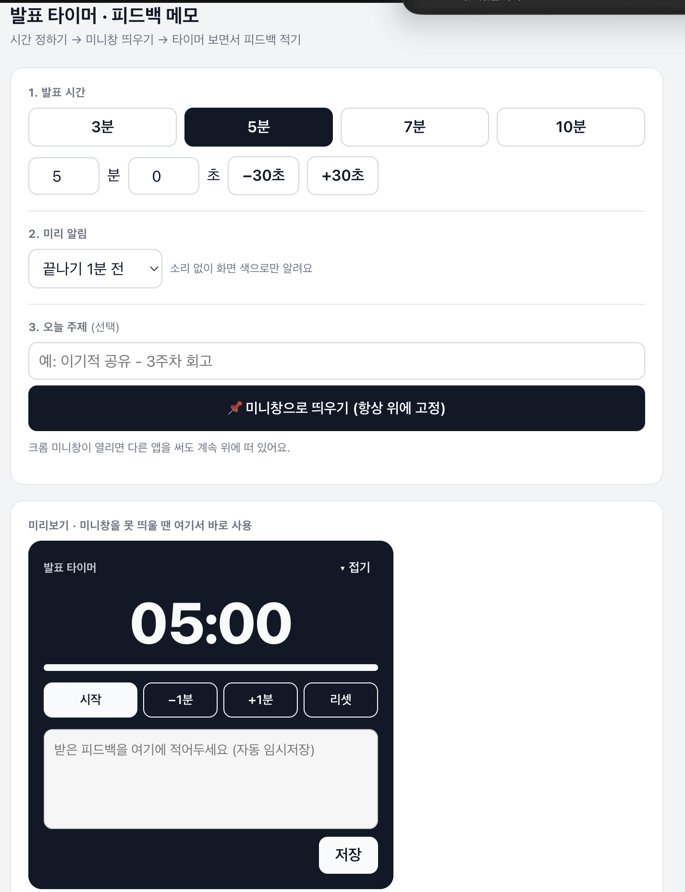

<!-- ⬆️ 위 --- 사이는 운영용 메모예요. 건드리지 말고 그대로 두세요. -->

# 썬 자기소개 카드

- 닉네임: 썬
- 하는 일: 15년차 마케터. 지금은 스타트업에서 사업개발 하는 중

---

## 🙋 자기소개

### 1. MBTI

> ESFJ

### 2. 이것만큼은 자신 있어요

> 처음 만난 누구와도 대화를 할 수 있어요. 그리고 취미 부자예요. 그중에서도 여행이 취미라서 한 달에 한 번은 어디든 다녀오려고 합니다.

### 3. AI로 여기까지 해봤어요

> 클로드 · 제미나이 · 챗GPT를 왔다갔다 하면서 쓰고 있어요. 주로 기획이랑 리서치에 쓰고, 영상이나 이미지 제작 툴은 아직 한 번도 안 써봤어요.
> 막히는 건 두 가지예요. AI가 제 뜻대로 안 움직일 때, 그리고 AI랑 같이 정한 걸 실제로 구현해야 할 때.

### 4. 조에 기여하고 싶은 점

> 여러 주제에 대해서 토론하고 대화하는 것, 그리고 아이스브레이커를 해볼게요. 잘 못할 것 같지만 최선을 다해보겠습니다.

### 5. 3기 기간 중 원하는 Before & After

**Before** — 지금 나는

> AI를 알긴 아는데, 활용 범위가 좁아요.

**After** — 3기 끝나고 나는

> 서로 다른 AI를 연결해서 다양하게 활용하고, 제 업무를 자동화하는 사람.

---

## 📝 과제

### 1. 오늘 구축한 GTM 코어 중 자랑하고 싶은 것

> **"이건 약점이 아니라 재료다"**
>
> 제가 잡은 주요 페르소나는 **이직하고 싶은 주니어 마케터**예요. 회사에서 한 일은 많은데, 그걸 하나로 뾰족하게 만들지 못해서 못 움직이고 있는 사람이요.
> 그런데 정리하다 보니 그게 **저랑 똑같은 모양의 문제**더라고요. 마케팅 15년에 커머스·AI·리테일로 폭은 넓은데 하나로 뾰족해지지 않아서 셀프 브랜딩을 못 하고 있는 상태. 스케일만 다를 뿐 같은 문제였어요.
>
> 여기서 나온 한 문장이 제일 마음에 들어요.
>
> > **"우리는 마케팅 전략을 파는 게 아니라, 오늘 당장 손댈 수 있는 첫 번째 할 일을 판다."**
>
> 그리고 제 경쟁 상대가 다른 강의나 컨설팅이 아니라 **「정지 상태」** 라는 것도 오늘 처음 정리됐어요. 더 좋은 걸 만드는 싸움이 아니라 움직이게 만드는 싸움이라는 것.
>
> 셀프 브랜딩 항상 해야지 하면서도 못 하고 있던 저인데, 아이데이션할 수 있는 장치가 잘 마련되어 있어서 하면서도 즐거웠어요.

### 2. 내가 만든 이기적 타이머 자랑하기

> **발표 시간을 재면서 받은 피드백까지 같이 적는 타이머**예요. 크롬 미니창으로 띄우면 다른 앱을 써도 화면 위에 계속 떠 있어요.
>
> 
>
> **소리 없이 색으로만 알려줘요.** 이기적 공유 중에 알람 소리가 울리면 안 되니까, 끝나기 1분 전부터 노랑 → 주황 → 빨강으로 색만 바뀌고, 시간이 넘어가면 초과된 시간을 세어줍니다.
> 그 아래에는 받은 피드백을 바로 적는 칸이 있어요. 자동으로 임시저장되고, 나중에 마크다운으로 복사하거나 파일로 내려받을 수 있어요.
>
> **제일 막혔던 순간** — 중간중간 시스템에 문제가 생길 때마다 클로드한테 물어보러 갔다 와야 해서 허둥지둥했어요. 만드는 것보다 "지금 뭐가 잘못된 건지" 알아내는 게 더 오래 걸렸습니다.
>
> **그래도 제일 마음에 드는 건** 아직 실전에서 써보진 않았지만 **어쨌든 구현이 됐다는 것.** 코드 한 줄 안 썼는데 굴러가요.
>
> **다음에 붙이고 싶은 것** — 발표자별로 피드백이 쌓여서, 한 주씩 모아볼 수 있으면 좋겠어요.

---
