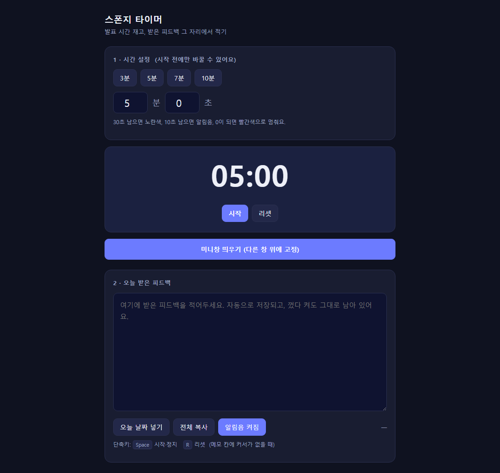

<!-- ⬆️ 위 --- 사이는 운영용 메모예요. 건드리지 말고 그대로 두세요. -->

# 체다 자기소개 카드

- 닉네임: 체다
- 하는 일: 제품·서비스 기획을 하다가, 최근 보안 거버넌스 부서로 옮겨 새로운 영역을 공부하고 있어요

---

## 🙋 자기소개

### 1. MBTI

INFJ

### 2. 이것만큼은 자신 있어요

끈기요. 엉엉 울면서도 끝까지 합니다.

### 3. AI로 여기까지 해봤어요

GPT로 번역하고 로드맵 짜는 정도만 써봤어요.
그런데 오늘 클로드 코드도 써보고 깃허브에서 클론도 해보고, 초면에 엄청나게 많은 걸 배웠습니다!!

### 4. 조에 기여하고 싶은 점

기획 관련 인사이트를 같이 나눠볼 수 있지 않을까 싶어요.

### 5. 3기 기간 중 원하는 Before & After

**Before** — 지금 나는

AI를 호기심의 영역에 두고 막연하게 두려워하고 있었어요.

**After** — 3기 끝나고 나는

모르는 건 클로드한테 물어보면서 합니다!
몰라도 두려워하지 않는 나!! 호기심의 영역을 현실로 한 발 가져오기!

---

## 📝 과제

> **1번과 2번은 굳이 오늘 완성하지 않으셔도 돼요.**
> 내일(23일) 18:30까지 과제 제출해 주시면 **셸 2개씩 지급** (조 내 100% 제출 시)

### 1. 오늘 구축한 GTM 코어 중 자랑하고 싶은 것

<!-- 과제 마저 하고 추가 업데이트 예정 -->

### 2. 내가 만든 이기적 타이머 자랑하기

**어떤 타이머냐면** — 발표 시간을 재면서, 그 자리에서 받은 피드백을 바로 적어두는 타이머예요.

**마음에 드는 기능**
- `미니창 띄우기` — PPT나 Zoom 위에 계속 떠 있어서, 발표하면서 곁눈질로 남은 시간을 볼 수 있어요
- 30초 남으면 노란색 → 10초 남으면 알림음 → 0초에 빨간색 정지
- 피드백 메모가 자동 저장돼서, 껐다 켜도 그대로 남아 있어요
- `Space` 시작·정지, `R` 리셋 단축키

**제일 막혔던 순간**

만드는 것보다 **타이머에 어떤 기능을 넣을지 정하는 게** 오히려 더 어려웠어요.
클로드가 하나씩 물어봐 주는 방식도 아직은 좀 어색해서, 답을 고르는 데 시간이 걸렸습니다.

**다음에 붙이고 싶은 기능**

발화 템포를 조절하도록 도와주는 기능이요.
남은 시간만 보여주는 게 아니라, 지금 말이 너무 빠른지 느린지도 알려주면 좋겠어요.

---
