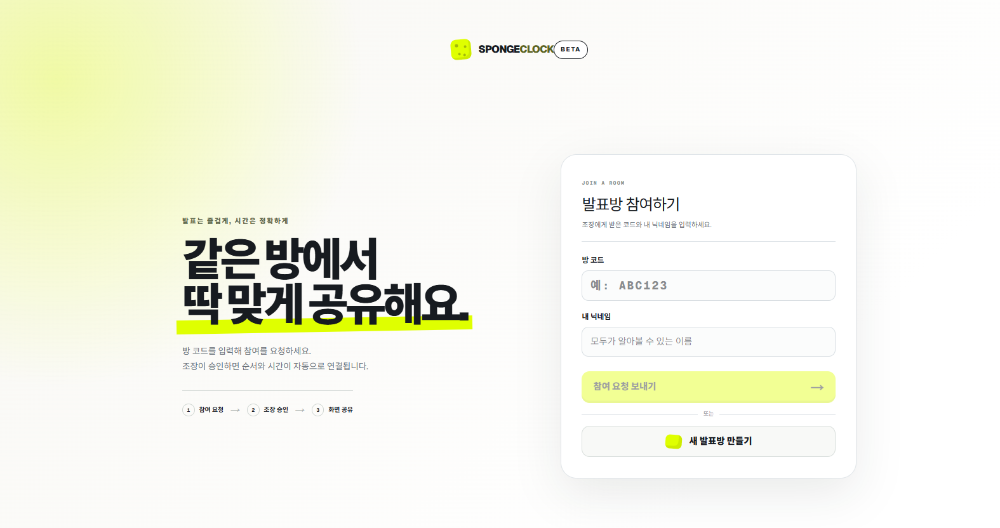
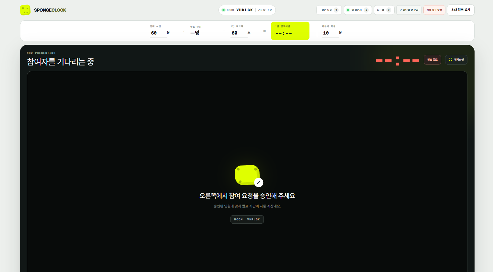

<!-- ⬆️ 위 --- 사이는 운영용 메모예요. 건드리지 말고 그대로 두세요. -->

# 키노 자기소개 카드

- 닉네임: 키노
- 하는 일: AI강사 · 운동처방 운동 트레이너

---

## 🙋 자기소개

### 1. MBTI

> INFP

### 2. 이것만큼은 자신 있어요

> 요즘 어딜 가든 아는 사람이 꼭 한 명은 있더라고요. 신기하기도 하고, 생각보다 제가 사람들이랑 잘 지내고 있나 봐요. 요즘 참 운이 좋다 싶어요.
>
> 뭔가에 푹 빠져 있진 않아요. 솔직히 요즘은 좀 쉬고 싶고요. 그래도 몸 잘 쓰는 법, 운동 더 잘하는 법에는 계속 관심이 가요. AI로는 뭘 하면 좋을지, 어떻게 정리해야 더 잘할 수 있을지도 요즘 자주 생각하고요.

### 3. AI로 여기까지 해봤어요

> AI로 초등학생부터 시니어까지 가르쳐 봤어요. 강의 끝나면 이런저런 제안을 많이 해주셔서, "어, 나 수업 괜찮게 했나?" 싶기도 하고요.
>
> 이제 AI는 손에 좀 익었으니까, 이걸 제 운동 쪽이랑 어떻게 연결하면 좋을지가 요즘 제일 큰 고민이에요.

### 4. 조에 기여하고 싶은 점

> 분위기 메이커, 그리고 기술 쪽으로 막힐 때 옆에서 거들게요. 어려운 거 있으면 편하게 물어보세요. 같이 풀면 되죠.
>
> 대신 저 혼자 신나면 좀 심심하잖아요. 여러분도 편하게 막 던져주세요. 저는 리액션 하나는 자신 있어요!

### 5. 3기 기간 중 원하는 Before & After

**Before** — 지금 나는

> AI는 곧잘 쓰는데, 내 팬층이랑 운동 쪽에 어떻게 연결할지는 아직 못 찾았다.

**After** — 3기 끝나고 나는

> 운동과 AI로 사업 방향을 잡고, 하나씩 굴리면서 인플루언서까지 되는 걸 목표로 한다.

---

## 📝 과제

> **1번과 2번은 굳이 오늘 완성하지 않으셔도 돼요.**
> 내일(23일) 18:30까지 과제 제출해 주시면 **셸 2개씩 지급** (조 내 100% 제출 시)

### 1. 오늘 구축한 GTM 코어 중 자랑하고 싶은 것

제 브랜드 **flowfull Core**의 한 문장이 제일 마음에 들어요.

> ## "우리는 운동 수업을 파는 게 아니라,
> ## 자기 몸에 맞게 움직이며 일상을 지속할 힘을 판다."

비전공자로 시작해 운동처방 석사까지 왔고, 쇄골 골절 재활도 직접 겪으면서 확신하게 된 게 있어요. 사람을 몰아붙이지 않고, 스스로 감당할 수 있는 좋은 자세로 차근차근 성공하게 하는 거요. 무섭던 동작을 자기 몸에 맞는 강도로 딱 한 번 해내는 순간, "어, 나도 되네?" 하는 마음이 생기더라고요. 그 감각이 사람을 오래 운동하게 만들고요. 그래서 저는 수업이 아니라 일상을 이어갈 힘을 판다고 정리했어요.

### 2. 내가 만든 이기적 타이머 자랑하기

**한 줄 소개** — 저 혼자 쓰는 타이머가 아니라, 스폰지 클럽 다 같이 쓸 수 있는 발표·피드백 클락 `SPONGECLOCK`이에요. 방을 만들어서 초대 링크만 공유하면, 전체 시간을 발표 인원으로 나눠서 1인 발표 시간을 알아서 계산해줘요.

**실행 화면**

👉 직접 써보기: https://spongeclock.amuse-ai.chatgpt.site/

**제일 막혔던 순간** — 여럿이 같이 쓰는 도구인데 혼자 만들다 보니 테스트가 참 어렵더라고요. 결국 사람들한테 직접 써보게 하고 피드백을 받으니까 훨씬 나아졌어요. 혼자 끙끙대는 것보다 같이 써보는 게 답이었어요.

**다음에 붙이고 싶은 기능**
- 발표에 대한 피드백을 그 자리에서 주고받을 수 있는 기능
- 실제로 여러 사람이 함께 쓸 수 있도록 다듬기
- 스폰지 시트와 연동해서 발표·피드백 내용이 자동으로 정리되게 만드는 방법 고민

---
