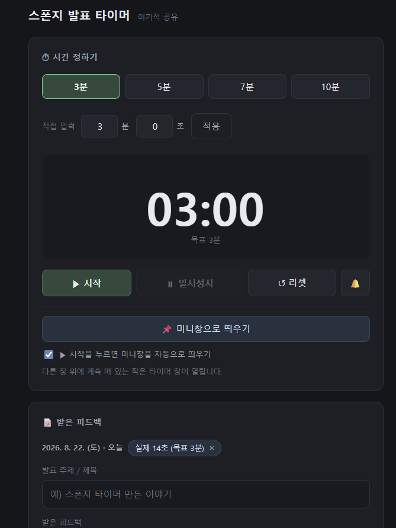
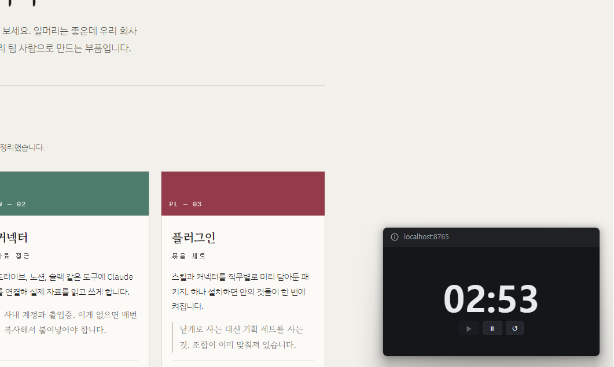

<!-- ⬆️ 위 --- 사이는 운영용 메모예요. 건드리지 말고 그대로 두세요. -->

# 테리 자기소개 카드

- 닉네임: 테리
- 하는 일: 공조 엔지니어링 중소기업에서 관리 업무 (인사 · 총무 · 재무)

---

## 🙋 자기소개

### 1. MBTI

> ISFJ

### 2. 이것만큼은 자신 있어요

> **창업도 해봤고, 직장 생활도 오래 해봤습니다.**
>
> 소셜 섹터에서 직접 창업해본 경험이 있고, 지금은 중소기업에서 인사 · 총무 · 재무를 한꺼번에 돌리고 있습니다. 그래서 새로 창업하는 대표들에게 "이 사업이 잘될 수 있는 방법"을 상담하고 멘토링해왔습니다. 소셜 섹터 액셀러레이팅 회사의 협력 멘토로도 가끔 참여하고 있습니다.
>
> 사람들이 저에게 자주 물어보는 건 대체로 두 가지입니다 — **회사 운영 자금**, 그리고 **사람 채용**.

### 3. AI로 여기까지 해봤어요

> 회사 업무 위주로 써왔습니다. **시장 조사 · 간단한 보고서 작성 · 엑셀 자료 만들기** 정도까지요.
>
> 다만 사용 방식이 계속 **채팅**에 머물러 있습니다. 물어보고 답을 받아서 제가 옮겨 쓰는 구조라, AI가 직접 일을 처리하게 만드는 단계는 아직 안 해봤습니다. 그게 지금 제 막힌 지점입니다.

### 4. 조에 기여하고 싶은 점

> **회사 운영의 현실 문제**에 대해서는 실무 기준으로 코멘트 드릴 수 있습니다. 사람 뽑는 일, 돈 흐르는 일, 조직 세팅하는 일 — 인사 · 총무 · 재무를 매일 돌리는 자리에 있으니까요.
>
> 창업자 자리와 직장인 자리를 둘 다 앉아봤기 때문에, 대표 입장과 실무자 입장을 같이 놓고 볼 수 있는 것도 도움이 될 것 같습니다.

### 5. 3기 기간 중 원하는 Before & After

**Before** — 지금 나는

> AI에게 물어보고 답을 받아 쓰는 단계. 채팅 밖으로 나가본 적이 없습니다.

**After** — 3기 끝나고 나는

> 바이브 코딩 · 클로드 코드를 통해 **에이전트 AI 형태**로, 더 깊이 있게 AI를 쓰고 있고 싶습니다. 묻고 받아쓰는 게 아니라, 일을 맡겨서 돌아가게 만드는 쪽으로요.

---

## 📝 과제

### 1. 오늘 구축한 GTM 코어 중 자랑하고 싶은 것

> ## "우리는 **멘토링**을 파는 게 아니라,
> ## **소셜 섹터에서도 투자받을 수 있는 사업의 큰 그림**을 판다."

제일 마음에 드는 건 이 한 문장입니다.

처음에는 "초기 창업 대표의 사람과 돈"으로 시작했어요. 제가 인사 · 총무 · 재무를 매일 돌리고 있고, 사람들이 저에게 묻는 것도 대체로 자금과 채용이니까요. 그런데 질문을 따라가다 보니 **제가 진짜로 줄 수 있는 게 뭔지**가 다른 데서 나왔습니다.

일반 기업에서도 일해봤고, 창업도 해봤고, 소셜 섹터에서도 일해봤습니다. 그중에서 **소셜 섹터에서 실제로 투자를 유치해본 경험**이 있다는 게 핵심이었어요. 소셜 섹터에서 조언하는 사람들은 대개 지원금과 보조금 이야기를 합니다. 그 씬에서 투자까지 가본 사람은 드물다는 걸, 이 대화를 하면서 처음 정리하게 됐습니다.

그래서 고객 말로 옮긴 문장이 이렇게 나왔습니다.

> **"이거 해보니까, 지원금 말고도 길이 있다는 걸 알겠어요."**

지원금 사이클 안에서 버티는 창업 2년차 대표에게, **밖에도 길이 있다고 말해줄 수 있는 사람**이 제 자리라는 걸 알게 된 게 오늘의 소득입니다.

*(전체 코어는 같은 폴더의 [테리_GTM코어_v0.1.md](테리_GTM코어_v0.1.md) 에 정리해두었습니다.)*

### 2. 내가 만든 이기적 타이머 자랑하기

**발표 시간을 재고, 받은 피드백까지 그 자리에서 같이 남기는 타이머를 만들었습니다.**

시작을 누르면 타이머가 **미니창으로 바뀌어 다른 창 위에 팝업처럼 계속 떠 있습니다.** 발표 자료를 띄워놓고 발표하는 중에도 남은 시간이 계속 보입니다.

#### 실행 화면

- **시간 정하기** — 3 · 5 · 7 · 10분 프리셋, 또는 분·초 직접 입력
- **시작 · 일시정지 · 리셋**, 그리고 알림 벨
- **미니창으로 띄우기** — "시작을 누르면 미니창을 자동으로 띄우기"를 켜두면 시작과 동시에 떠오릅니다
- **받은 피드백** — 발표 주제와 그 자리에서 받은 피드백을 적어두고, **실제로 걸린 시간이 태그로 남습니다** (예: `실제 14초 (목표 3분)`)

미니창은 이렇게 다른 화면 위에 얹혀 있습니다. 창을 옮겨 다녀도 타이머가 가려지지 않습니다.

#### 제일 막혔던 순간

**미니창으로 전환되는 기능**이었습니다. 웹 화면이 다른 창 위에 떠 있게 만드는 걸 어떻게 구현하는지 몰라서 여기서 한참 멈춰 있었어요.

방법을 직접 찾아내는 대신, **"타이머를 시작하면 자동으로 미니창으로 바뀌게 다시 만들어달라"** 고 요청하는 쪽으로 풀었습니다. 어떻게 만드는지는 몰랐지만 **무엇이 되어야 하는지는 제가 알고 있었으니까요.** 그걸 말로 정확히 넘기는 게 방법이었습니다.

#### 다음에 붙이고 싶은 기능

지금은 이 정도면 충분한 것 같습니다. 시간 재고, 미니창으로 띄우고, 피드백 남기는 것 — 원래 필요했던 건 다 됩니다. 몇 번 써보고 아쉬운 게 생기면 그때 붙이겠습니다.

---
