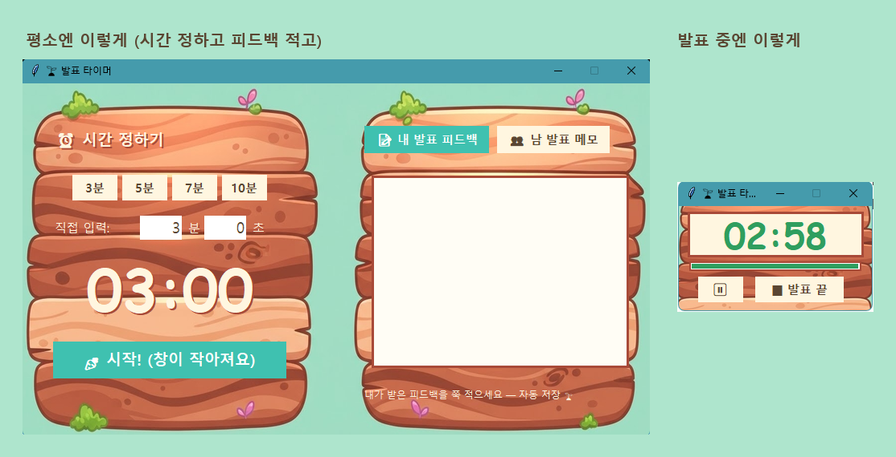

<!-- ⬆️ 위 --- 사이는 운영용 메모예요. 건드리지 말고 그대로 두세요. -->

# 양세 자기소개 카드

- 닉네임: 양세
- 하는 일: 프리랜서 

---

## 🙋 자기소개

### 1. MBTI

>ENFJ

### 2. 이것만큼은 자신 있어요

> 일·취미 뭐든 좋아요.

 분위기 띄우기?? 수다쟁이
> 지금 빠져있는 것도 좋아요.

간단한 운동(슬로우조깅), 맨몸운동, 위스키

### 3. AI로 여기까지 해봤어요

> 어떤 AI 도구로 무엇까지 해봤나 · 아직 막힌 곳이 있다면?

이미지 생성, 이미지 to 비디오, 영상편집 반자동화 os 등

### 4. 조에 기여하고 싶은 점

> 내가 우리 조에 줄 수 있는 것. (예: 꼼꼼한 피드백 · 분위기 메이커 · 기술 서포트)

조장으로써 으쌰으쌰!! 분위기 메이커, 제가 알고 있는걸 최대한 공유

### 5. 3기 기간 중 원하는 Before & After

**Before** — 지금 나는

>아직 뭔가 판다는 개념이 어려운 상태

**After** — 3기 끝나고 나는

>AI영상을 만드는걸 내가 이렇게 할수 있어서 팔고 있었으면 좋겠다.

---

## 📝 과제

> **1번과 2번은 굳이 오늘 완성하지 않으셔도 돼요.**
> 내일(23일) 18:30까지 과제 제출해 주시면 **셸 2개씩 지급** (조 내 100% 제출 시)

### 1. 오늘 구축한 GTM 코어 중 자랑하고 싶은 것

> 오늘 잡은 GTM 코어를 통째로 옮겨 적지 않으셔도 돼요.
> **가장 마음에 드는 한 조각**만 골라서 자랑해주세요.

### 2. 내가 만든 이기적 타이머 자랑하기

> 완성도는 상관없어요. **굴러가기만 하면 자랑거리**입니다.
>
> 이런 걸 적으면 좋아요
> - 어떤 타이머인지 한 줄로
> - 실행 화면 스크린샷
> - 만들면서 제일 막혔던 순간과 어떻게 뚫었는지
> - 다음에 더 붙이고 싶은 기능
>
> 스크린샷은 Claude Code에 던지고 **"이기적 타이머 자랑하는 데에 이런 식으로 넣어줘"** 하면 알아서 들어가요.

**한 줄로** — 발표 시간을 재고, 발표가 끝나면 받은 피드백을 그 자리에서 적어두는 타이머. 다른 창을 띄워도 항상 맨 위에 떠 있습니다.

평소엔 왼쪽처럼 크게 띄워두고 시간을 정합니다. 시작을 누르면 오른쪽처럼 작아집니다. 발표 화면을 가리지 않는 크기예요. 피드백 칸은 두 개입니다. 하나는 내가 받은 피드백, 하나는 남 발표 보면서 적는 메모.

**제일 막혔던 순간 두 개**

처음에 제가 구조를 잘못 잡은 거였습니다. 발표 **중에** 피드백을 적는 화면으로 만들어놨어요. 그런데 피드백은 발표가 끝나야 받죠. 발표하면서 자기 피드백을 적는 사람은 없습니다. 순서를 바꿨습니다.

두번째는 클로드는 역시나 이미지를 잘 못만든다는거야 결국엔 따로 만들어서 가지고 왔어

**다음에 더 붙이고 싶은 것**

- 쌓인 피드백에서 반복되는 지적 뽑아보기 — "화면이 작다"를 몇 번 들었는지 같은 것
- 시간 다 됐을 때 소리로 알리기 (지금은 색만 바뀝니다)
- 창을 아예 간판 모양으로 자르기 (지금은 사각형 창 안에 간판 그림)

**오늘 배운 것** — 바꾸기 전에 세이브부터 하면 마음 놓고 갈아엎을 수 있습니다. 오늘 디자인을 여섯 번 바꿨는데, 매번 되돌아갈 수 있게 해두고 바꿨어요. 비개발자고 클로드 코드는 오늘 처음 썼습니다.

---
