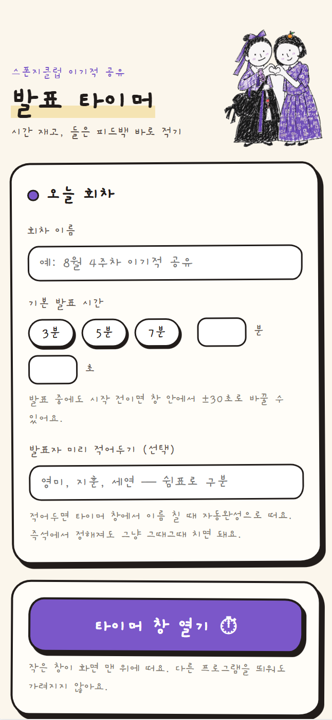

<!-- ⬆️ 위 --- 사이는 운영용 메모예요. 건드리지 말고 그대로 두세요. -->

# 영미 자기소개 카드

- 닉네임: 영미
- 하는 일: 로컬브랜딩 마케터

---

## 🙋 자기소개

### 1. MBTI

> ESTJ

### 2. 이것만큼은 자신 있어요

> 이야기 들어주기

### 3. AI로 여기까지 해봤어요

> 이벤트 사이트 제작

### 4. 조에 기여하고 싶은 점

> 으쌰으쌰 — 아무도 낙오하지 않도록 서로 응원해주기

### 5. 3기 기간 중 원하는 Before & After

**Before** — 지금 나는

> 배우고 있는 나

**After** — 3기 끝나고 나는

> 가르쳐 주는 나

---

## 📝 과제

> **1번과 2번은 굳이 오늘 완성하지 않으셔도 돼요.**
> 내일(23일) 18:30까지 과제 제출해 주시면 **셸 2개씩 지급** (조 내 100% 제출 시)

### 1. 오늘 구축한 GTM 코어 중 자랑하고 싶은 것

> 오늘 잡은 GTM 코어를 통째로 옮겨 적지 않으셔도 돼요.
> **가장 마음에 드는 한 조각**만 골라서 자랑해주세요.

### 2. 내가 만든 이기적 타이머 자랑하기

**발표 타이머** — 발표 시간을 재면서, 들은 피드백을 그 자리에서 바로 적어두는 타이머예요.

- 화면 맨 위에 뜨는 작은 창이라 다른 프로그램을 띄워도 안 가려져요
- 3분 / 5분 / 7분 버튼, 발표 중에도 ±30초로 조절
- 1분 남으면 주황색, 시간을 넘기면 분홍색으로 화면 전체가 바뀝니다
- 발표자 이름과 피드백은 치는 대로 자동 저장 — 회차별로 쌓이고 엑셀로 내려받을 수 있어요

**막혔던 순간** — 없었습니다. 프롬프트가 잘 잡혀 있어서 한 번에 굴러갔어요.
대신 예전에 그려둔 그림이 있어서 올려봤습니다. 손그림 느낌으로 화면 톤을 맞췄어요.

**다음에 붙이고 싶은 기능** — 전체 시간 중 지금 몇 %가 지났고 몇 %가 남았는지를,
발표자가 **놀라지 않게** 전달하기. 갑자기 "시간 다 됐어요"가 아니라, 흐름을 미리 알 수 있게요.

---
