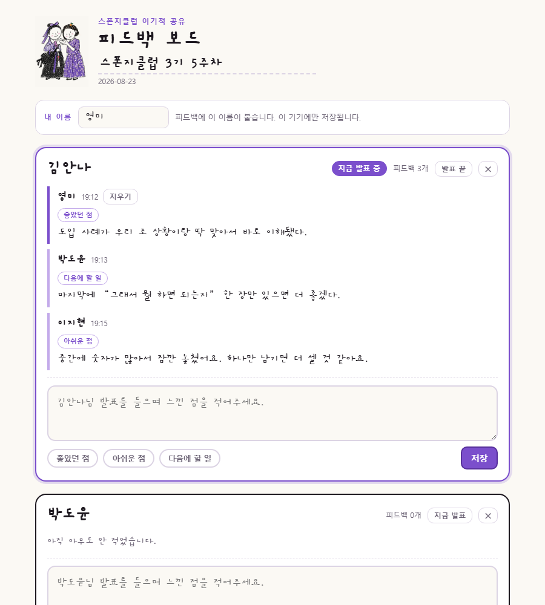

<!-- ⬆️ 위 --- 사이는 운영용 메모예요. 건드리지 말고 그대로 두세요. -->

# 영미 자기소개 카드

- 닉네임: 영미
- 하는 일: 로컬브랜딩 마케터

---

## 🙋 자기소개

### 1. MBTI

> ESTJ

### 2. 이것만큼은 자신 있어요

> 이야기 들어주기

### 3. AI로 여기까지 해봤어요

> 이벤트 사이트 제작

### 4. 조에 기여하고 싶은 점

> 으쌰으쌰 — 아무도 낙오하지 않도록 서로 응원해주기

### 5. 3기 기간 중 원하는 Before & After

**Before** — 지금 나는

> 배우고 있는 나

**After** — 3기 끝나고 나는

> 가르쳐 주는 나

---

## 📝 과제

> **1번과 2번은 굳이 오늘 완성하지 않으셔도 돼요.**
> 내일(23일) 18:30까지 과제 제출해 주시면 **셸 2개씩 지급** (조 내 100% 제출 시)

### 1. 오늘 구축한 GTM 코어 중 자랑하고 싶은 것

> 오늘 잡은 GTM 코어를 통째로 옮겨 적지 않으셔도 돼요.
> **가장 마음에 드는 한 조각**만 골라서 자랑해주세요.

### 2. 내가 만든 이기적 타이머 자랑하기

**공유 타이머** — 조별 이기적 공유 시간에, 발표 시간을 재면서
들은 피드백을 그 자리에서 바로 적어두는 타이머예요.

- **시간이 매번 달라도 괜찮아요.** 슬라이더로 1~30분, 사람마다 따로 정할 수도 있어요
  (위 화면에서 이지현님만 5분)
- **1분 남으면 주황, 0초에 소리 한 번, 넘기면 빨강**으로 초과 시간이 올라가요.
  강제로 끊지는 않아요 — 끊는 건 사람이 할 일이니까요
- **다른 창을 띄워도 안 가려집니다.** 크롬의 분리 팝업으로 작은 창이 떨어져 나와
  화면 구석에 늘 떠 있어요. 발표 슬라이드를 가리지 않아요
- **피드백은 치는 대로 저장돼요.** 저장 버튼이 없고, 껐다 켜도 남아 있어요

**그리고 다 같이 적는 보드** — "다른 사람이 뭐라고 적었는지 볼 수 없나?" 싶어서 하나 더 붙였어요.
링크를 받은 조원이 각자 적으면, 저장하는 순간 모두의 화면에 나타납니다.

**막혔던 순간 세 가지**

1. **글씨체가 궁서체로 나왔어요.** 손글씨를 인터넷에서 받아오게 해놨는데 그게 실패하면
   윈도우가 대신 궁서를 꺼내 쓰더라고요. 원인을 더 파는 대신 글씨체를 파일 안에 통째로 심었어요.
   이제 인터넷이 없어도 똑같이 나옵니다.
2. **몰래 사라지던 설정.** 어떤 사람 시간을 3분으로 따로 정해뒀는데,
   나중에 기본 시간 슬라이더를 움직이면 그 3분이 조용히 덮어써졌어요. 테스트하다 발견해서 막았어요.
3. **공유되는 화면에서는 팝업이 안 떠요.** 브라우저가 그걸 최상위 창에서만 허용해서,
   우회가 안 됩니다. 그래서 시간 재기는 내 컴퓨터에서, 같이 적는 건 보드에서 하도록 나눴어요.

그림은 예전에 그려둔 걸 올렸어요. 화면 톤을 이 그림에 맞췄습니다.

**다음에 붙이고 싶은 기능** — 전체 시간 중 지금 몇 %가 지났고 몇 %가 남았는지를,
발표자가 **놀라지 않게** 전달하기. 갑자기 "시간 다 됐어요"가 아니라, 흐름을 미리 알 수 있게요.

---
