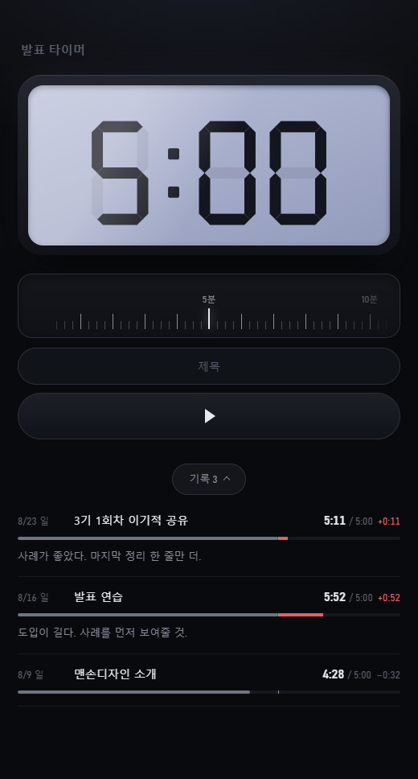
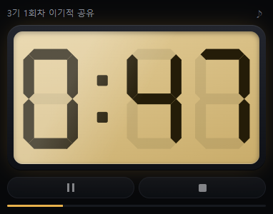
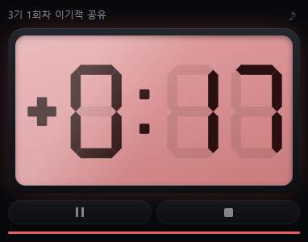
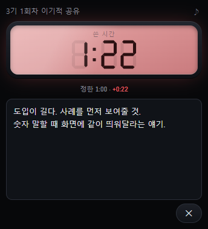

<!-- ⬆️ 위 --- 사이는 운영용 메모예요. 건드리지 말고 그대로 두세요. -->

# 정숙 자기소개 카드

- 닉네임: 정숙
- 하는 일: 반려동물 용품 제조·판매 업체 **온라인혁신부서** 근무 · **대학교 재학 중**

---

## 🙋 자기소개

### 1. MBTI

> **INFJ**

### 2. 이것만큼은 자신 있어요

> **어떤 업무든 다양한 아이디어로 일단 시도하고, 굴려가며 수정해나가기.**
> 정답을 먼저 찾기보다 던져보고 고치는 쪽이 편합니다.
>
> 요즘 빠져있는 건 **세컨드 브레인 프로젝트**예요.
> 회사에서 멀티로 처리할 일이 많아지니까, 정말 간단한 것도 몇 초 만에 까먹더라고요.
> 그래서 수시로 메모를 남기고 **내 기억을 통째로 저장해두는 시스템**을 만들고 있습니다.

### 3. AI로 여기까지 해봤어요

> **해본 것**
> - 슬랙 메시지 자동화
> - CS 응대 방식 매뉴얼화
> - 부서 슬랙 · 노션 규격화
> - 스토어 운영
>
> **아직 막힌 곳**
> VS Code와 클로드 코드를 쓰기 시작한 지 얼마 안 돼서, **개발 지식이 부족합니다.**
> 그때그때 "이건 고도화하면 좋겠다" 싶은 아이디어를 자연어로 바이브코딩하는 건 하고 있어요.
> 다만 **개발하는 순서 · 고도화하는 순서 · 보안적으로 고쳐야 할 부분** 같은 건 전혀 감이 없습니다.
> 이 부분 아시는 분 계시면 많이 알려주세요 🙏

### 4. 조에 기여하고 싶은 점

> **다양한 수정 · 기획 · 개발 아이디어를 나누는 것.**
> 혼자 쥐고 있기보다 계속 꺼내놓는 쪽이 서로한테 남는 게 많다고 생각해요.

### 5. 3기 기간 중 원하는 Before & After

**Before** — 지금 나는

> 아이디어만 많고, 아직 실행하지 못한 것들이 많은 상태.

**After** — 3기 끝나고 나는

> 수많은 아이디어를 고도화해서 **실체가 있는 서비스 · 프로젝트 · 사업안**으로 만들어나간 상태.

---

## 📝 과제

> **1번과 2번은 굳이 오늘 완성하지 않으셔도 돼요.**
> 내일(23일) 18:30까지 과제 제출해 주시면 **셸 2개씩 지급** (조 내 100% 제출 시)

### 1. 오늘 구축한 GTM 코어 중 자랑하고 싶은 것

> **B · 고객이 느끼는 변화** 칸에서 나온 한 문장입니다. (맨손디자인 — 상세페이지·자사몰 제작)
>
> ```
> 우리는 상세페이지를 파는 게 아니라,
> 허접해 보이던 판매 페이지가 전문가 셀러의 스토어로 보이는 상태를 판다
> ```
>
> **왜 이게 마음에 드는지**
>
> 인터뷰 초반에 "겉으로 보면 뭘 파느냐"는 질문에 저는 **"상세페이지 이미지랑 자사몰 HTML"** 이라고 답했습니다.
> 그러니까 제가 판다고 생각한 건 **결과물 파일**이었어요.
>
> 그런데 Before/After를 짚는 순간 답이 달라졌습니다.
> 고객이 겪고 나면 뭐가 달라지냐고 물으니 제 입에서 나온 말이
> **"허접한 판매 페이지가 전문가 셀러의 스토어로 바뀐다"** 였어요.
> 물건은 그대로인데 **보이는 급이 바뀌는 것** — 그게 제가 실제로 파는 거였습니다.
>
> **검증까지 돌려보니 타깃이 틀려 있었습니다**
>
> 세운 코어를 가상 고객 5명(핵심 2 · 경계 2 · 비사용 1)한테 부딪혀봤어요.
> 그런데 **핵심 페르소나 자리에 앉힌 한 명이 거절**했습니다.
>
> > *"거창하게 매출 늘리려는 게 아니에요. 매달 생활비 나오면 됩니다."*
> > — 48세, 나주에서 온라인 잡화점 운영
>
> **온라인 셀러라고 다 제 고객이 아니었어요.** 성장을 원하지 않는 셀러한테는 안 팔립니다.
> 그래서 타깃을 *"매출이 안 나오는 초보 셀러"* 에서
> **"매출을 올리고 싶은데 페이지에서 막힌 초보 셀러"** 로 한 칸 좁혔습니다.
>
> **제일 아팠던 건 이겁니다**
>
> 5명 중 **"지금 당장 하겠다"는 사람이 한 명도 없었어요.** 3명이 조건부였는데 전부 *"나중에"* 였습니다.
> 필요는 다들 인정하는데 **지금 해야 할 이유**를 아무도 못 찾은 거예요.
>
> 제 문의가 전부 **기간·금액**만 물어보고 끝나는 이유가 여기 있었습니다.
> 급할 이유가 없으니 견적만 받아보고 가는 거였어요.
> 그동안 이걸 "가격이 비싼가" 로만 생각했는데, 가격 문제가 아니라 **시급함이 없는 문제**였습니다.
>
> 코어는 A~D 네 블록 다 잡았고, 아이템(첫 지점)은 아직 비워뒀습니다.

### 2. 내가 만든 이기적 타이머 자랑하기

> **발표 시간을 재고, 그 자리에서 받은 피드백을 바로 적는 타이머**입니다.
>
> 조별 이기적 공유 때 사람마다 시간이 들쭉날쭉한 게 계속 걸렸어요.
> 그리고 피드백은 받는 순간엔 다 기억할 것 같은데, 다음 주면 하나도 안 남아 있었습니다.
> 그래서 그 둘을 한 화면에 붙였습니다.
>
> 배포는 안 합니다. 제 컴퓨터에서 파일 하나 더블클릭하면 켜져요.
>
> **① 시간 정하기 — 눈금자를 손으로 밀어서**
>
> 
>
> 공유 시간이 매번 달라서 버튼으로 고르는 방식은 안 맞았습니다. 눈금자를 밀어 15초 단위로 맞춥니다.
> 숫자판은 진짜 전자시계처럼 **꺼진 획도 흐리게 비치게** 그렸어요. 폰트로는 이게 안 돼서 획을 하나하나 직접 그렸습니다.
>
> **② 발표 중 — 다른 창 위에 계속 떠 있는 미니창**
>
> 
>
> **③ 시간을 넘기면 판 전체가 빨개집니다**
>
> 
>
> 숫자 색만 바뀌면 발표하면서 못 봅니다. 판 전체가 물들어야 곁눈으로도 보여요.
> 마지막 1분은 호박색, 0이 되면 빨강 + 얼마나 넘겼는지.
>
> **④ 끝나면 그 자리에서 피드백**
>
> 
>
> 발표 자료가 전체화면이면 브라우저로 돌아갈 수가 없습니다. 그래서 미니창 안에서 바로 적게 했어요.
> 저장 버튼이 없습니다. 타이핑하는 도중에 계속 저장돼서, 다 적기 전에 창을 닫아도 남습니다.
>
> ---
>
> **제일 막혔던 것 — "다른 창 위에 떠 있기"**
>
> 웹페이지는 브라우저 창 안에 갇혀 있습니다. PPT를 전체화면으로 켜는 순간 타이머가 뒤로 숨어요.
> 앱으로 설치하는 방법까지 알아봤는데, 크롬에 **미니창(Document Picture-in-Picture)** 이라는 게 있었습니다.
> 유튜브 미니 플레이어의 그 창인데, 아무 화면이나 넣을 수 있더라고요. **설치 없이 이게 됩니다.**
>
> **두 번째로 막혔던 것 — 슬라이더가 마우스로 안 움직임**
>
> 눈금자를 만들었는데 트랙패드로만 되고 마우스로는 꿈쩍도 안 했습니다.
> 가로 스크롤이라 일반 마우스 휠이 안 먹고 드래그도 안 되는 거였어요.
> 끌기·휠·방향키를 직접 붙였더니, 이번엔 **빠르게 끌고 손을 떼면 값이 원래 자리로 튕겨 돌아갔습니다.**
> 브라우저가 "스크롤됐다"고 알려주는 게 한 박자 늦어서, 손 떼는 순간엔 아직 옛 값이 남아 있던 거였습니다.
>
> **제일 배운 것 — 다 만들고 "검수해봐" 시킨 것**
>
> 다 됐다 싶었을 때 클로드 코드한테 검수를 시켰더니 문제를 5개 찾아왔습니다. 그중 하나가 이거였어요.
>
> ```
> 미니창에 피드백을 적는 중에 메인 창에서 지난주 기록을 열어보면,
> 오늘 적은 피드백이 지난주 기록을 덮어쓴다
> ```
>
> 창 두 개가 "지금 어느 기록에 쓰는 중인가"를 **변수 하나로 같이 쓰고 있던 것**이 원인이었습니다.
> 피드백을 안 잃으려고 만든 도구가 피드백을 지우고 있었던 거죠.
>
> 더 웃긴 건 이걸 고치다가 **새 버그를 하나 만들었다는 것**입니다.
> "창이 닫히기 전에 무조건 저장"을 넣었는데, 바뀐 게 없어도 닫힐 때마다 통째로 덮어써서
> 다른 창이 저장해둔 걸 되돌려버렸어요. 이것도 잡아서 고쳤습니다.
>
> **만들고 나서 안 것**: 굴러가게 만드는 것보다 **"어디가 잘못됐는지 물어보는 것"** 이 훨씬 남았습니다.
> 안 물어봤으면 저 버그 다섯 개를 그대로 들고 다음 주 공유에 갔을 거예요.
>
> **다음에 붙이고 싶은 것**
>
> - **연달아 두 명 재기** — 지금은 정지하면 미니창을 닫았다 다시 열어야 합니다. 조 전체 진행에 쓰려면 여기가 막혀요.
> - **기록 내보내기** — 지금은 앱 안에서만 봅니다. 노션에 붙여넣게 복사 버튼 하나.
> - **연도 표시** — 기록에 `8/23` 만 나와서 해가 바뀌면 헷갈립니다.
>
> 앱 파일은 제 컴퓨터에만 있습니다. 파일 하나 더블클릭하면 켜지는 형태라 설치할 게 없어요.
> 써보고 싶으신 분 있으면 폴더째로 드릴게요. 크롬이나 엣지에서만 미니창이 뜹니다.

---
