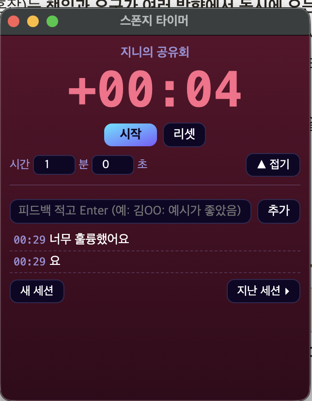

<!-- ⬆️ 위 --- 사이는 운영용 메모예요. 건드리지 말고 그대로 두세요. -->
# 찌니 자기소개 카드

- 닉네임: 찌니
- 하는 일: 시놀(주) COO — 시니어 라이프스타일 플랫폼 '시놀' +  매칭 서비스 '시럽인연' 운영

---

## 🙋 자기소개

### 1. MBTI

> ENFJ (가끔 I와 P로 새는 ENFJ)

### 2. 이것만큼은 자신 있어요

> **커뮤니티 빌드업.** 
사람 모으고, 판 깔고, 끝까지 굴러가게 만드는 게 취미입니다. 
>
> **25년차 서비스 기획.** P2P·영상·소셜커머스·라이프스타일까지 여러 스타트업에서 기획했습니다.
>
> 요즘 빠져있는 건 **사주·명리학.** 취미로 파다가 결국 서비스로 만들어버렸습니다.

### 3. AI로 여기까지 해봤어요

> **Claude Code로 개발자 없이 혼자 만듭니다.** 

2기 때 4개 만들었어요 — 사주 해석 웹앱, SAJU&CO(글로벌 Z세대 사주 브랜드), AzaazA(운동 기록), CheckWall(QR 행사 체크인).
>
> 제 방식은 스킬 라이브러리예요. 서비스 기획, 홍보, 카피, 사주 해석 같은 작업을 스킬로 만들어두고 재사용합니다.
>
> **막힌 곳** — 만드는 건 되는데 **파는 건 한 번도 안 해봤습니다.** 만들고 끝. 사용자한테 닿아본 적이 없어요.

### 4. 조에 기여하고 싶은 점

> **기획 서포트.** 아이디어를 기능 정의·IA·와이어프레임까지 끌어내리는 게 제 본업입니다. 조원분들 아이디어가 "좋은 생각"에서 멈추지 않게 구조로 잡아드릴게요.
>
>
> 그리고 분위기. 제 브랜드 키워드가 **열정 NONSTOP**입니다.

### 5. 3기 기간 중 원하는 Before & After

**Before** — 지금 나는

> 2기에서 만든 것들도 다 제 손안에만 있습니다. 

**After** — 3기 끝나고 나는

> 2기에서 만든 서비스를 **실제로 GTM 테스트까지 돌려본 사람.**
>
> 그리고 **개인 OS 구축 + SNS 브랜딩 완료.** 11월 미국 출국 전에 세팅을 끝내는 게 목표입니다.

---

## 📝 과제

> **1번과 2번은 굳이 오늘 완성하지 않으셔도 돼요.**
> 내일(23일) 18:30까지 과제 제출해 주시면 **셸 2개씩 지급** (조 내 100% 제출 시)

### 1. 오늘 구축한 GTM 코어 중 자랑하고 싶은 것

> 오늘 잡은 GTM 코어를 통째로 옮겨 적지 않으셔도 돼요.
> **가장 마음에 드는 한 조각**만 골라서 자랑해주세요.

2기때 만든 사주서비스 방향 재 설정함

### 2. 내가 만든 이기적 타이머 자랑하기

> 완성도는 상관없어요. **굴러가기만 하면 자랑거리**입니다.
>
> 이런 걸 적으면 좋아요
> - 어떤 타이머인지 한 줄로
> - 실행 화면 스크린샷
> - 만들면서 제일 막혔던 순간과 어떻게 뚫었는지
> - 다음에 더 붙이고 싶은 기능
>
> 스크린샷은 Claude Code에 던지고 **"이기적 타이머 자랑하는 데에 이런 식으로 넣어줘"** 하면 알아서 들어가요.

---
