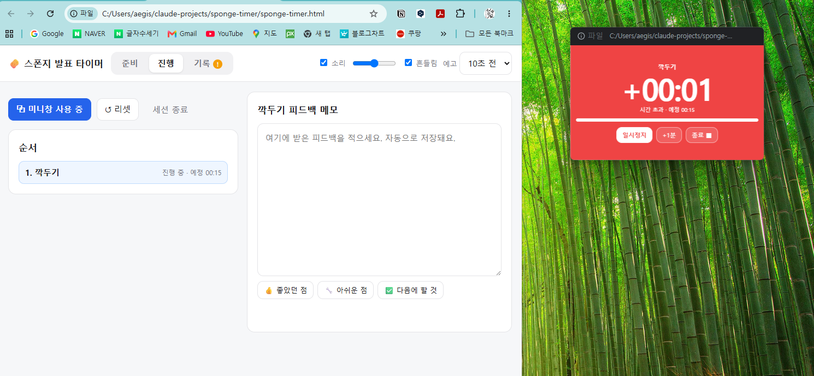
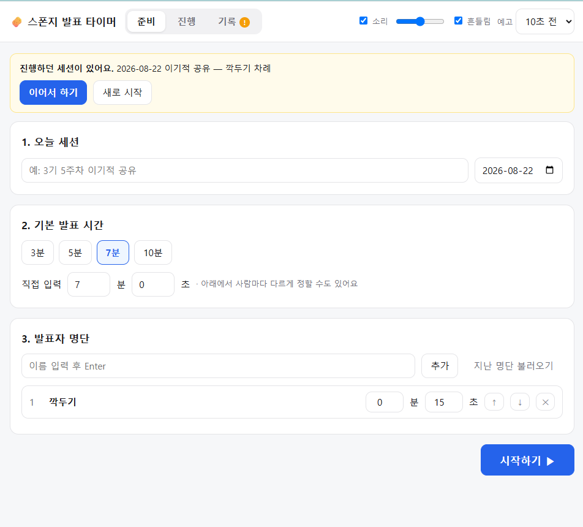

<!-- ⬆️ 위 --- 사이는 운영용 메모예요. 건드리지 말고 그대로 두세요. -->

# 깍두기 자기소개 카드

- 닉네임: 깍두기
- 하는 일: 한의원 운영 (추나요법 체형교정 · 디스크/협착증 치료)

---

## 🙋 자기소개

### 1. MBTI

> 아직 한 번도 해본 적이 없어요. 검사해보고 다시 푸시하겠습니다!

### 2. 이것만큼은 자신 있어요

> 한의원을 20년 넘게 운영하고 있습니다. 그만큼 오래 한 일이니 이건 제일 잘하겠네요.
> 주로 **추나요법으로 체형교정**을 하고, **디스크·협착증 치료**를 하고 있습니다.
>
> 취미는 캠핑 정도겠네요. 산에 가는 걸 좋아합니다.

### 3. AI로 여기까지 해봤어요

> 최근 한의원 자동화에 관심이 생겨서 **클로드**로 배우기 시작했습니다. 이제 2주 정도밖에 안 됐어요.
> 그동안 써왔던 여러 칼럼들을 **주제별로 정리하는 일**부터 해보고 있습니다.
>
> 앞으로 도전해보고 싶은 것
> - 환자 상담 내용을 글로 바꾸기
> - 그걸 차트에 연동하기
> - 안내서 발송까지 자동으로

### 4. 조에 기여하고 싶은 점

> AI에 대해서는 생소한 분야이고, 일하는 곳이 누구랑 협업하는 분야가 아니라서 뒤쳐져서 조에 누가 되지 않도록 최선을 다하겠습니다.
> 사실 조별활동을 한 번도 해보지 못한 **학력고사 세대**예요 ㅠ

### 5. 3기 기간 중 원하는 Before & After

**Before** — 지금 나는

> AI 용어가 외계어인 나

**After** — 3기 끝나고 나는

> AI 용어에 능통한 내가 될 겁니다

---

## 📝 과제

> **1번과 2번은 굳이 오늘 완성하지 않으셔도 돼요.**
> 내일(23일) 18:30까지 과제 제출해 주시면 **셸 2개씩 지급** (조 내 100% 제출 시)

### 1. 오늘 구축한 GTM 코어 중 자랑하고 싶은 것

> 오늘 잡은 GTM 코어를 통째로 옮겨 적지 않으셔도 돼요.
> **가장 마음에 드는 한 조각**만 골라서 자랑해주세요.

### 2. 내가 만든 이기적 타이머 자랑하기

**발표 시간 재고, 피드백까지 그 자리에서 적는 타이머를 만들었습니다.**

발표 시간을 재면서 그 자리에서 받은 피드백까지 바로 적어두는 타이머예요. 화면 위에 작게 떠 있어서 발표 화면을 가리지 않습니다.

매주 이기적 공유 때 사람마다 발표 시간이 들쭉날쭉한 게 계속 마음에 걸렸어요. 그리고 그 자리에서 받은 좋은 피드백이 늘 어딘가로 흩어졌고요. 두 개를 한 화면에서 해결하고 싶었습니다.

#### 실행 화면

왼쪽은 타이머, 오른쪽은 피드백 메모입니다. **미니창 띄우기**를 누르면 타이머만 작은 창으로 떨어져 나와 발표자료 위에 계속 떠 있습니다.

- 10초 전 — 노랑 + "삑"
- 0초 — 빨강 + "삑삑삑" + 흔들림
- 이후 — `+00:32` 처럼 초과 시간 카운트업
- 메모는 타이핑하는 대로 자동 저장

준비 화면에서 세션 이름·기본 발표 시간·발표자 명단을 정합니다. 사람마다 시간을 다르게 줄 수도 있고, 지난 명단을 그대로 불러올 수도 있어요.

#### 제일 막혔던 순간

**"다른 창 위에 계속 떠 있기"** 였습니다. 웹페이지는 원래 그게 안 돼서 설치형 프로그램을 만들까 고민했는데, 매주 켜야 하는 물건에 설치 과정이 붙으면 안 쓰게 될 것 같았어요. 크롬의 미니창 기능을 찾아 써서 **파일 하나 더블클릭으로 끝나게** 만들었습니다.

진짜 막힌 건 그 다음이었어요. 미니창은 잘 떴는데, **거기로 타이머를 옮기는 순간 타이머가 멈췄습니다.** 시간을 세는 코드가 원래 창만 쳐다보느라 옮겨간 타이머를 못 찾은 거였어요.

무서운 건 미니창을 안 띄우면 멀쩡해 보인다는 것 — 실전에서 처음 알았으면 그 주 공유는 날아갔을 겁니다.

> 배운 건 하나였어요. **만든 걸 실제로 눌러보기 전까지는, 만든 게 아니다.**

#### 다음에 붙이고 싶은 것

- 내 발표 습관 통계 — "나는 평균 몇 분 초과하는 사람인가"
- 노션 자동 연결
- 조원들이 각자 폰으로 보낸 피드백이 한 화면에 모이기
- 카페용 무음 모드

---
