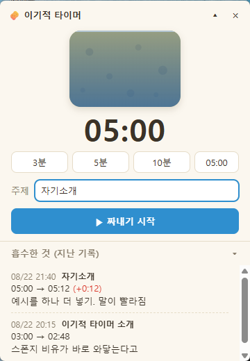
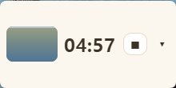
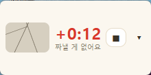
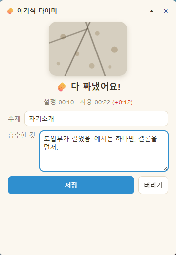

<!-- ⬆️ 위 --- 사이는 운영용 메모예요. 건드리지 말고 그대로 두세요. -->

# 문대표 자기소개 카드

- 닉네임: 문대표
- 하는 일: 게임기획 (본업) · 고양이 간식 브랜드 운영 (부업)

---

## 🙋 자기소개

### 1. MBTI

> **ISTJ**

### 2. 이것만큼은 자신 있어요

> 게임기획이 본업이라 **숫자로 쪼개서 보는 편**입니다. 광고 리포트든 리뷰 데이터든 일단 펼쳐놓고 어디가 새는지 찾아봅니다.
>
> 부업 브랜드는 OEM으로 제품을 만들어 혼자 팔고 있어서 **상세페이지·CS·정산까지 다 해봤습니다.** 본업이 있다 보니 안 되는 건 빨리 접는 법도 배웠습니다.
>
> 요즘 빠져있는 건 **AI 도구를 손에 맞게 세팅하는 것**입니다. 도구 자체를 다듬는 데 시간을 꽤 씁니다.

### 3. AI로 여기까지 해봤어요

> **Codex와 Claude Code를 일상적으로 씁니다.**
>
> 아직 막힌 곳 — 도구 쓰는 건 익숙한데, 정작 **매출로 이어지는 마케팅은 아직 손으로 하고 있습니다.**

### 4. 조에 기여하고 싶은 점

> 혼자 이것저것 만들어보면서 익힌 게 많은 편이라, **AI에 입문하시는 분들께** 필요하시다면 도움을 드리고자 합니다.

### 5. 3기 기간 중 원하는 Before & After

**Before** — 지금 나는

> 부업 쇼핑몰의 **전환율은 나쁘지 않은데 들어오는 사람이 적습니다.** 유입을 늘려야 하는데 마케팅은 아직 전부 손으로 하고 있습니다.

**After** — 3기 끝나고 나는

> **본업이 따로 있으니 부업에서는 손이 최대한 가지 않아야 합니다.** 유입을 늘리는 일이 AI의 도움으로 알아서 굴러가는 상태를 만들고 싶습니다.
>
> 그리고 일단 만들어보고 **결과를 남기는 사람**으로 기억되면 좋겠습니다.

---

## 📝 과제

> **1번과 2번은 굳이 오늘 완성하지 않으셔도 돼요.**
> 내일(23일) 18:30까지 과제 제출해 주시면 **셸 2개씩 지급** (조 내 100% 제출 시)

### 1. 오늘 구축한 GTM 코어 중 자랑하고 싶은 것

> 오늘 잡은 GTM 코어를 통째로 옮겨 적지 않으셔도 돼요.
> **가장 마음에 드는 한 조각**만 골라서 자랑해주세요.

### 2. 내가 만든 이기적 타이머 자랑하기

**🧽 마르는 스폰지 타이머** — 발표 시간이 물처럼 마르는 걸 보면서 발표하고, 끝나면 받은 피드백을 그 자리에서 적어두는 **항상 위에 떠 있는 Electron 앱**입니다.

시간 = 물로 잡았습니다. 시작하면 흠뻑 젖은 스폰지가 점점 마르고, 다 마르면 **"짜낼 게 없어요"**.
**발표는 짜내기, 피드백은 흡수한 것** — 스폰지 하나로 두 기능이 묶입니다.

#### 실행 화면

**① 시작 전** — 프리셋(3·5·10분)이나 직접 입력으로 시간을 정하고 주제를 적습니다. 아래는 지난 기록 = "흡수한 것"

**② 발표 중** — 컴팩트 모드로 줄어들어 다른 창 위에 떠 있습니다. **스폰지에서 색이 빠지는 정도가 남은 시간**입니다

**③ 시간 초과** — 0:00을 지나면 빨간 `+` 숫자로 계속 셉니다. 스폰지는 바싹 말라 갈라집니다

**④ 끝나고** — 설정 시간 대비 실제 사용 시간을 보여주고, 받은 피드백을 바로 적습니다. **껐다 켜도 남습니다**

#### 만들면서

크게 막힌 곳은 없었습니다. 대신 **순서를 지킨 게 컸습니다.** 설계 스펙을 문서로 먼저 굳히고 → 11개 태스크로 쪼갠 구현 계획을 세우고 → 시간 계산·스폰지 건조도·기록 정렬 같은 순수 로직을 테스트로 먼저 짠 다음 화면을 붙였습니다. 단위 테스트 30개가 돌고 있습니다.

제일 신경 쓴 건 **작은 창에서 숫자를 안 봐도 상태가 읽히는가**였습니다. 발표 중에는 화면을 들여다볼 여유가 없으니, 스폰지의 색과 갈라짐만으로 *여유 있음 · 슬슬 마무리 · 넘겼음* 이 구분되게 만들었습니다.

#### 다음에 더 붙이고 싶은 기능

설계 때 일부러 뺀 것들입니다.

- **일시정지** — 중간에 질문이 끼어들면 시계를 멈추고 싶어집니다
- **기록 수정·삭제** — 지금은 열람만 됩니다
- **테마·색 바꾸기** — 스폰지 말고 다른 것도

---
