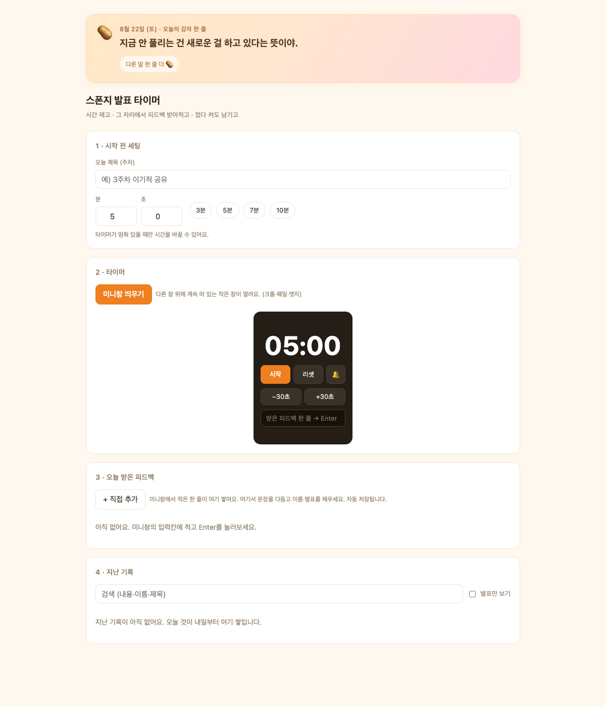

<!-- ⬆️ 위 --- 사이는 운영용 메모예요. 건드리지 말고 그대로 두세요. -->

# 감자 자기소개 카드

- 닉네임: 감자
- 하는 일: 온라인 셀러

---

## 🙋 자기소개

### 1. MBTI

> ENFJ

### 2. 이것만큼은 자신 있어요

> **잡생각하기 · 일 사랑하기 · 그걸 정리하기.**
> 이 셋이 세트로 굴러가요. 생각이 자꾸 뻗어나가는데, 그게 결국 일 얘기로 돌아오고, 마지막엔 정리가 됩니다.

### 3. AI로 여기까지 해봤어요

> - **힉스필드** — 제품 변형 없이 모델컷 생성
> - **ChatGPT** — 업무 작업 전반
> - **클로드** — 마진 계산 같은 실무 계산
>
> 도구는 하나씩 쓰고 있는데, **아직은 매번 제가 붙어 있어야 돌아가요.**
> 그래서 제일 하고 싶은 건 **자동화** — 반복되는 걸 알아서 굴러가게 만드는 것.

### 4. 조에 기여하고 싶은 점

> **셀러 실전 경험 공유.**
> 실제로 팔면서 부딪힌 것들 — 소싱 · 상세페이지 · 마진 · CS — 필요하실 때 편하게 물어봐 주세요.

### 5. 3기 기간 중 원하는 Before & After

**Before** — 지금 나는

> **번아웃이 올까 말까 하는 상태.** 혼자 감당하기엔 일이 많아서, 직원이 필요한 시점이에요.

**After** — 3기 끝나고 나는

> **반복 업무는 AI에 넘기고, 저는 커머스 제품 확장에 집중하고 있기.**

---

## 📝 과제

> **1번과 2번은 굳이 오늘 완성하지 않으셔도 돼요.**
> 내일(23일) 18:30까지 과제 제출해 주시면 **셸 2개씩 지급** (조 내 100% 제출 시)

### 1. 오늘 구축한 GTM 코어 중 자랑하고 싶은 것

> 오늘 잡은 GTM 코어를 통째로 옮겨 적지 않으셔도 돼요.
> **가장 마음에 드는 한 조각**만 골라서 자랑해주세요.

### 2. 내가 만든 이기적 타이머 자랑하기

**스폰지 발표 타이머** — 시간만 재는 게 아니라, **발표 중에 받은 피드백을 그 자리에서 한 줄씩 받아적어 남기는** 타이머예요.

**어떻게 쓰나요**

- 발표 시간을 정하고 **미니창**을 띄우면, 다른 프로그램 위에 작은 창이 계속 떠 있어요
- 피드백을 들으면서 그 미니창에 한 줄 적고 **Enter** → 바로 저장
- 끝나고 큰 화면에서 문장 다듬고, 말한 사람 이름과 ☆ 별표를 채우면 그날 기록 완성
- 남은 10초엔 주황색으로 깜빡이고, 0초가 지나면 `+00:23` 처럼 **초과 시간이 올라갑니다**

**제일 막혔던 순간**

> (여기에 한 줄만 채워주세요)

**다음에 더 붙이고 싶은 것**

- 기록을 파일로 내보내기 — 지금은 이 컴퓨터 크롬 안에만 쌓여요
- 발표자별로 모아 보기
- 회차별 피드백을 한눈에 비교하기

덤 — 상단에 **"오늘의 감자 한 줄"** 응원 문구를 넣었어요. 닉네임값 했습니다 🥔

---
