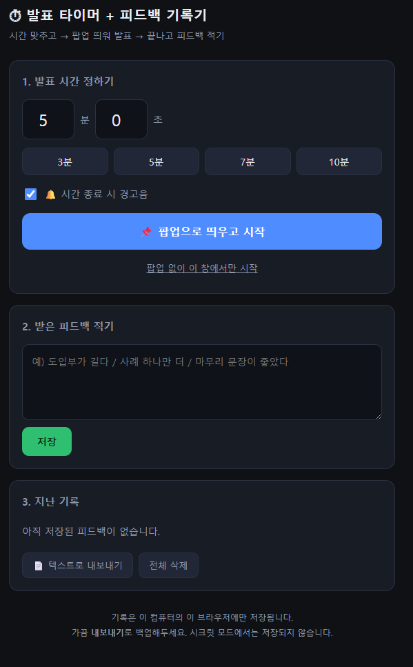

<!-- ⬆️ 위 --- 사이는 운영용 메모예요. 건드리지 말고 그대로 두세요. -->

# 오제제 자기소개 카드

- 닉네임: 오제제 (제가 제일 좋아하는 돈카츠집 이름에서 따왔습니다 🍽️)
- 하는 일: 온라인 커머스

---

## 🙋 자기소개

### 1. MBTI

> ENFJ

### 2. 이것만큼은 자신 있어요

> **상품 기획** — 무엇을 팔지 잡아내는 일.
>
> **설득** — 사람을 움직여서 실제로 되게 만드는 일.
>
> 요즘 빠져있는 것 — **웨이트 트레이닝** 💪

### 3. AI로 여기까지 해봤어요

> **써본 도구** — ChatGPT · Claude · Gemini · 젠스파크(Genspark) · 클링(Kling) · 프리픽(Freepik)
>
> **실제로 해본 것**
> - 상세페이지 · 제품 샷 제작
> - 기획서 · 발주서 작성
> - 경쟁사 제품 리뷰 분석 및 리뷰 생성
>
> **아직 막힌 곳** — 자동화를 아직 못 붙였습니다. 매번 채팅창에 자연어로 직접 요청하다 보니 결과 퀄리티가 일정하게 나오질 않아요. 결국 사람 손이 계속 들어가야 해서, 일을 늘리려면 직원을 더 써야 하나 고민하게 되는 지점이 제일 아쉽습니다. 이번에 AI를 제대로 배워서 이 고민들을 정리해보려고 합니다.

### 4. 조에 기여하고 싶은 점

> **1. 실전 경험에 기반한 꼼꼼한 피드백** — 온라인 커머스를 하고 있어서, 조원분들이 기획하시는 제품이나 타겟 분석에 대해 실전 경험을 바탕으로 봐드릴 수 있습니다.
>
> **2. 광고 · 마케팅 지원** — 지금 제 제품 판매가 유료 광고로 돌아가고 있습니다. 광고 쪽에서 도움 드릴 일이 있으면 적극적으로 지원하겠습니다.
>
> **3. 깊이 있는 피드백** — 평소 주변에서 피드백이 깊다는 얘기를 자주 듣는 편입니다. 그만큼 실질적으로 도움이 되는 피드백을 많이 드리겠습니다.

### 5. 3기 기간 중 원하는 Before & After

**Before** — 지금 나는

> AI를 쓰긴 쓰는데, 매번 채팅창에 손으로 자연어를 직접 입력하고 있습니다. AI의 능력이 100이라면 30도 채 못 쓰고 있는 상태예요.

**After** — 3기 끝나고 나는

> 장부 작성처럼 지금 막혀 있는 일들을 AI가 **제로투원으로** 해결해주는 구조를 갖추고 싶습니다.
>
> 그래서 **직원을 더 고용하지 않고도**, 최소한의 에너지만 들여서 — 지금까지 생각만 하고 못 하던 일들을 실제로 실행하고 실천하는 사람이 되어 있을 겁니다.

---

## 📝 과제

### 1. 오늘 구축한 GTM 코어 중 자랑하고 싶은 것

**자랑하고 싶은 조각 — B. 고객이 내 비즈니스를 통해 느끼는 변화**

> 그동안 저는 제 일을 **"무슨 상품을 파느냐"** 로 설명해왔습니다. 커머스를 하다 보면 자연스럽게 아이템 얘기부터 꺼내게 되거든요.
>
> 그런데 GTM 코어를 잡으면서 순서가 뒤집혔습니다. **아이템은 가장 자주 바뀌는 거라 맨 마지막**이라는 것.
>
> *"우리는 드릴을 파는 것이 아니라, 벽에 뚫린 구멍을 판다."*
>
> 이 문장 앞에서 한참 멈췄습니다. 내가 파는 게 물건이 아니라 **그 물건을 산 사람이 겪는 변화**라고 놓고 보니, 지금까지 상세페이지에서 어떤 카피는 먹히고 어떤 건 안 먹혔는지가 그제서야 설명이 되더라고요.
>
> 제 판매는 유료 광고로 돌아갑니다. 소구점 하나에 성과가 크게 갈리는 구조인데, 지금까지 그걸 **감으로** 잡아왔습니다. 코어를 문서 한 장으로 세워두니 **감으로 잡던 걸 근거로 잡을 수 있는 자리**가 생겼다는 게 오늘의 가장 큰 소득입니다.

### 2. 내가 만든 이기적 타이머 자랑하기

**⏱ 발표 타이머 + 피드백 기록기**

> **한 줄 소개** — 발표 시간을 재고, 끝나자마자 **그 자리에서 받은 피드백을 적어 쌓아두는** 도구입니다.

**어떻게 굴러가나요**

`시간 맞추고 → 팝업 띄워 발표 → 끝나고 피드백 적기`

- 시간 직접 입력 + **3 / 5 / 7 / 10분 프리셋** 버튼
- 종료 시 **경고음** 옵션
- **팝업 창으로 띄워서** 발표 화면 위에 올려두기 (원하면 현재 창에서만 실행)
- 피드백 입력 → 저장 → **지난 기록으로 누적**
- **텍스트로 내보내기** · 전체 삭제
- 기록은 브라우저에만 저장 (시크릿 모드에서는 저장되지 않는다는 안내까지 넣었습니다)

**제일 신경 쓴 것**

> 타이머에서 멈추지 않은 것. **시간을 재는 것보다, 발표 직후에 휘발되는 피드백을 붙잡는 게 진짜 목적**이었습니다. 그래서 타이머 바로 아래에 기록칸을 붙이고, 쌓인 걸 내보낼 수 있게 만들었어요.

**막혔던 순간**

> 사실 이번엔 크게 막힌 데가 없었습니다. 생각한 대로 한 번에 굴러갔어요.
>
> 그래서 오히려 남은 아쉬움은 다른 쪽입니다 — **막히지 않았다는 건 아직 어려운 걸 안 건드려봤다는 뜻**이기도 하니까요. 다음엔 좀 더 욕심내서 붙여볼 생각입니다.
**다음에 더 붙이고 싶은 기능**

> **발표에 대한 AI 자체 피드백.**
>
> 지금은 *사람이 준* 피드백을 받아 적는 구조입니다. 여기에 **AI가 발표 자체에 대해 주는 피드백**을 붙이고 싶어요. 사람 피드백과 AI 피드백이 한자리에 쌓이면, 발표를 거듭할수록 내가 어디서 반복적으로 걸리는지가 보일 거라고 생각합니다.

---