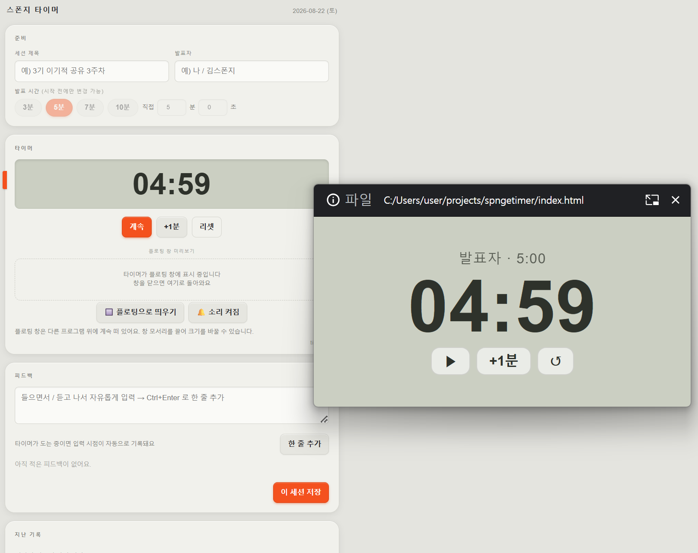

<!-- ⬆️ 위 --- 사이는 운영용 메모예요. 건드리지 말고 그대로 두세요. -->

# 피터 자기소개 카드

- 닉네임: 피터
- 하는 일: 1인 창업자 · 글로벌 로밍 서비스(여행)

---

## 🙋 자기소개

### 1. MBTI

> 아직 모르겠어요.

### 2. 이것만큼은 자신 있어요

> 사업을 고민하는 것 — 그것 하나만큼은 자신 있습니다.
>
> 요즘 몰입 중인 것
> - AI 학습을 통한 마케팅
> - 바이브 코딩

### 3. AI로 여기까지 해봤어요

> 해본 것 — 동영상 작업, 이미지 작업
>
> 주로 쓰는 곳 — 사업기획서 정리와 자료 작성

### 4. 조에 기여하고 싶은 점

> AI 과제 쪽으로는 조언을 드리기보다 도움을 받는 처지일 것 같습니다.
>
> 대신 드릴 수 있는 것 — 그동안 쌓인 사업 환경에 대한 조언 정도는 나눌 수 있어요.

### 5. 3기 기간 중 원하는 Before & After

**Before** — 지금 나는

> 배움의 초보입니다.

**After** — 3기 끝나고 나는

> AI를 통해서도 누군가와 협업이 가능한 수준이 된 제 모습을 보는 것.

---

## 📝 과제

> **1번과 2번은 굳이 오늘 완성하지 않으셔도 돼요.**
> 내일(23일) 18:30까지 과제 제출해 주시면 **셸 2개씩 지급** (조 내 100% 제출 시)

### 1. 오늘 구축한 GTM 코어 중 자랑하고 싶은 것

> 아직은 준비 중입니다.

### 2. 내가 만든 이기적 타이머 자랑하기

> **스폰지 타이머** — 발표 세션용 타이머. 세션 제목 · 발표자 · 발표 시간을 미리 세팅해두고 돌립니다.

> 붙여놓은 기능
> - 발표 시간 프리셋(3 · 5 · 7 · 10분) + 분·초 직접 입력, 시작 전에만 변경 가능
> - **플로팅 창** — 다른 프로그램 위에 계속 떠 있고, 창 모서리를 끌어 크기를 바꿀 수 있음
> - 계속 · +1분 · 리셋 버튼, 소리 알림 on/off
> - **피드백 기록** — 발표 들으면서 Ctrl+Enter로 한 줄씩 추가. 타이머가 도는 중이면 입력 시점이 자동으로 찍힘
> - 세션 저장 → 지난 기록에서 다시 보기
>
> 제일 막혔던 순간 —
>
> 다음에 더 붙이고 싶은 기능 —

---
