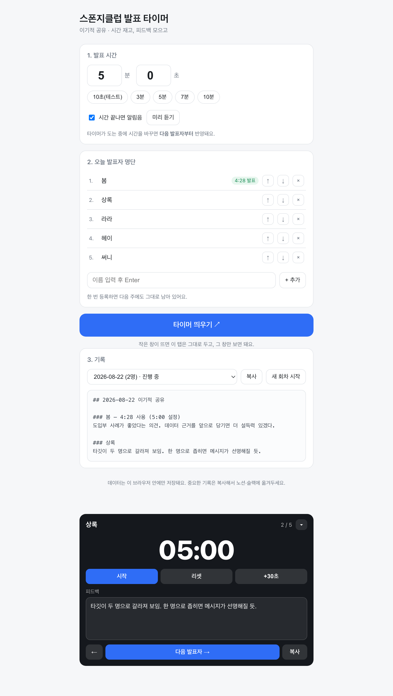
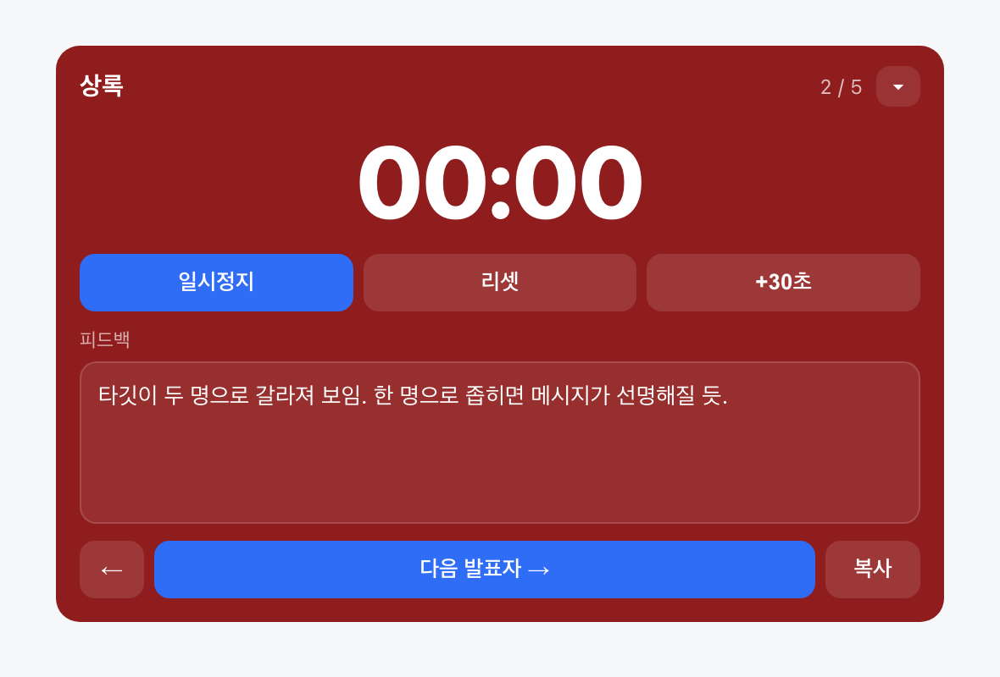

<!-- ⬆️ 위 --- 사이는 운영용 메모예요. 건드리지 말고 그대로 두세요. -->

# 봄 자기소개 카드

- 닉네임: 봄
- 하는 일: 인플루언서 플랫폼 마케팅 회사에서 **앱테크 서비스를 운영하는 오퍼레이터**입니다. 마케팅도 하고 정산도 하고, 기획과 프로모션까지 맡고 있어요.

---

## 🙋 자기소개

### 1. MBTI

> **INFJ** 입니다!
> 온화하고 유순한 편이라, 다른 사람들을 유심히 잘 관찰하는 것 같아요.

### 2. 이것만큼은 자신 있어요

> **모두가 지치지 않게 응원하고, 함께 손잡고 이끌어 가는 것.**
>
> 앞에서 혼자 빨리 가는 쪽보다는, 옆에서 같이 걷는 쪽이 편해요.
> 누가 지금 힘든지 먼저 눈에 들어오는 편이라, 그걸 그냥 지나치지 않는 게 제 몫이라고 생각합니다.

### 3. AI로 여기까지 해봤어요

> 일에 바로 붙여서 쓰고 있어요.
>
> - **정산 자동화** — 오퍼레이터 업무 중 가장 손이 많이 가던 부분
> - **프로모션 기획** — 기획 단계부터 AI와 같이 굴립니다
> - **캐러셀 자동화** — 콘텐츠 제작 쪽
>
> 최근에는 현업에서 **메신저 안에 자동화 봇을 붙여보고 있어요.** 지금 제일 재미있는 지점입니다.
>
> 이번 셋업데이에는 클로드 코드로 **발표 타이머**를 하나 만들어봤고요. (아래 과제 2번에 있어요)

### 4. 조에 기여하고 싶은 점

> **지치고 힘들 때, 기댈 수 있는 김봄봄이 되어 드리겠습니다.**
>
> 3기가 7주짜리인데, 중간에 한 번은 다들 처지는 순간이 오잖아요.
> 그때 6조에서 아무도 조용히 사라지지 않게 챙기는 사람이 되고 싶어요.

### 5. 3기 기간 중 원하는 Before & After

**Before** — 지금 나는

> **단순 사고의 OS**를 만들고 쓰고 있어요.
> 필요한 것 하나가 생기면 그것만 해결하는 식이라, 만들어둔 것들이 서로 이어지지는 않습니다.

**After** — 3기 끝나고 나는

> **깊은 사고의, 서로 연관되어 있는 유기적인 OS**를 구축하고 싶어요.
> 하나를 굴리면 다음 것이 따라 굴러가는 구조로요.
>
> 그리고 지금 활동하고 있는 **스폰지타임즈의 스폰지클럽 계정이 많은 사람들에게 바이럴되는 것**이 목표입니다.

---

## 📝 과제

> **1번과 2번은 굳이 오늘 완성하지 않으셔도 돼요.**
> 내일(23일) 18:30까지 과제 제출해 주시면 **셸 2개씩 지급** (조 내 100% 제출 시)

### 1. 오늘 구축한 GTM 코어 중 자랑하고 싶은 것

> 오늘 잡은 GTM 코어를 통째로 옮겨 적지 않으셔도 돼요.
> **가장 마음에 드는 한 조각**만 골라서 자랑해주세요.

### 2. 내가 만든 이기적 타이머 자랑하기

**한 줄로 말하면** — 이기적 공유 시간 재면서, 받은 피드백까지 그 자리에서 같이 모아주는 **발표 타이머**입니다.

발표 시간을 재는 것만으로는 부족했어요. 정작 남아야 할 건 **그날 받은 피드백**인데 그게 매번 흩어졌거든요.
그래서 타이머와 피드백 칸을 **한 화면에** 붙였고, 끝나면 `복사` 한 번으로 회차 전체가 마크다운으로 나옵니다.

**실행 화면**

발표 시간 정하고 → 오늘 명단 넣고 → `타이머 띄우기 ↗` 를 누르면 작은 창이 떠요.
발표 자료를 가리지 않게 **다른 창 위에 계속 떠 있고**, `▾` 로 더 얇게 줄일 수도 있습니다.
`다음 발표자 →` 를 누르면 지금 사람 기록이 저장되고 타이머가 새로 맞춰져요.

**시간이 끝나면 이렇게 바뀝니다**

남은 1분엔 노란색, 시간이 끝나면 빨간색 + 알림음 "삑삑삑".
사회자가 *"시간 다 되셨어요"* 라고 말을 끊지 않아도, 발표자가 화면 색만 보고 알아서 마무리하게 하고 싶었어요.
**말로 지적하지 않고 색으로 알려주는 것** — 이 부분이 제일 마음에 듭니다.

**만들면서 제일 막혔던 순간**

**타이머 숫자가 중간에 멈춰버렸어요.**

작은 팝업 창을 띄우면 원래 탭이 '숨김' 상태가 되는데,
크롬이 **숨긴 탭의 타이머를 5분 뒤부터 1분에 한 번꼴로 늦춰버립니다.**
그래서 5분짜리 발표를 재는 동안 숫자가 그대로 굳어 있었어요. 처음엔 제가 뭘 잘못한 줄 알고 한참 헤맸습니다.

뚫은 방법은 **시계가 도는 위치를 옮긴 것**이었어요.
원래 탭에서 시간을 재지 말고, **지금 화면이 떠 있는 창 쪽에서** 재게 바꿨습니다.
패널이 팝업으로 옮겨가면 시계도 같이 따라가요.

*"내가 틀린 게 아니라 브라우저가 원래 그렇게 동작하는 것"* 일 수도 있다 — 이걸 알게 된 게 제일 큰 수확이었습니다.

**다음에 더 붙이고 싶은 기능**

| | |
|---|---|
| **서버 저장** | 지금은 브라우저 안에만 저장돼서, 크롬 기록을 지우면 같이 날아가요. 제일 먼저 붙이고 싶은 것 |
| **슬랙으로 바로 보내기** | `복사` → 붙여넣기 말고, 끝나면 조 채널에 회차 기록이 그냥 올라가게 |
| **발표 순서 섞기** | 매번 1번부터 시작하니까 뒷사람이 손해예요. 버튼 하나로 순서 셔플 |

---
