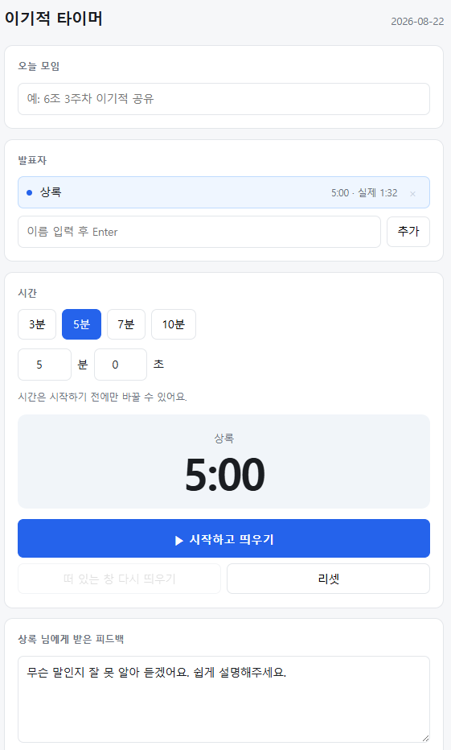

<!-- ⬆️ 위 --- 사이는 운영용 메모예요. 건드리지 말고 그대로 두세요. -->

# 상록 자기소개 카드

- 닉네임: 상록
- 하는 일: 한의사 · 상록한의원 원장

---

## 🙋 자기소개

### 1. MBTI

> **INTJ**
>
> 검사해본 적은 없고, 간단한 문답으로 추정해봤습니다.
> 혼자 있는 시간에 충전되고, 큰 그림과 가능성부터 보고, 원칙과 논리로 판단하고, 계획대로 착착 가는 편입니다.

### 2. 이것만큼은 자신 있어요

> **골프** 는 자신 있어요.
>
> 요즘 빠져있는 건 **AI** 입니다.

### 3. AI로 여기까지 해봤어요

> **영상 편집**은 **Vrew**로 해봤고,
> **문서 작성·편집·정리**는 **노션 · NotebookLM · Codex · Claude Code**를 써서 해봤습니다.

### 4. 조에 기여하고 싶은 점

> 작게는 **민폐 끼치지 않기**, 크게는 **낙오자 없게 손 끌어주기**.

### 5. 3기 기간 중 원하는 Before & After

**Before** — 지금 나는

> 혼자 이것저것 만져보는 단계.

**After** — 3기 끝나고 나는

> 내 손으로 서비스 하나 굴려본 상태.

---

## 📝 과제

> **1번과 2번은 굳이 오늘 완성하지 않으셔도 돼요.**
> 내일(23일) 18:30까지 과제 제출해 주시면 **셸 2개씩 지급** (조 내 100% 제출 시)

### 1. 오늘 구축한 GTM 코어 중 자랑하고 싶은 것

**B 블록의 한 문장**을 고르겠습니다.

> ## "우리는 통증 치료를 주는 게 아니라,
> ## 내 몸이 나아지고 있는지 스스로 아는 눈을 준다."

이 문장이 마음에 드는 이유는, **제가 진료실에서 제일 많이 듣는 질문에 정면으로 답하기 때문**입니다.

환자분들이 반복해서 묻는 말이 있습니다. **"언제 낫나요?"**
치료법을 묻는 게 아니라 **끝을 묻는 질문**입니다. 그런데 저는 여기에 날짜로 답할 수가 없었습니다.

코어를 세우면서 알게 된 건, 이 질문의 답이 날짜가 아니라 **스스로 아는 능력**이라는 것이었습니다.
언제 낫는지를 제가 알려주는 게 아니라, 나아지고 있는지를 **본인이 알아보게 되는 것**입니다.

한 가지 더 얻은 게 있습니다. **경쟁 상대가 누구인지가 바뀌었습니다.**

"이걸 안 보면 대신 뭘 하나요?"라는 질문에 답하다 보니, 답이 "다른 영상을 본다"가 아니라 **"아무것도 안 한다"**였습니다.
그러니까 제 싸움은 더 좋은 운동 영상을 만드는 싸움이 아니라 **움직이게 만드는 싸움**이고,
경쟁 상대는 다른 채널이 아니라 **아무것도 안 하는 저녁**이었습니다.

이걸 알기 전과 후는 만들 것이 완전히 달라집니다.

### 2. 내가 만든 이기적 타이머 자랑하기

**발표 시간을 재면서, 그 자리에서 받은 피드백까지 적어두는 타이머**를 만들었습니다.
다른 창 위에 작게 떠 있어서 발표 화면을 가리지 않습니다.

조별 이기적 공유 때 사람마다 발표 시간이 들쭉날쭉하고, 받은 피드백은 그 자리에서 흩어지는 게 아쉬웠습니다.
시간을 지켜 모두가 공평하게 공유하고, 받은 피드백이 한곳에 남게 하려고 만들었습니다.

*발표자 옆의 `5:00 · 실제 1:32`가 정한 시간과 실제 걸린 시간입니다. 아래 피드백은 브라우저를 꺼다 켜도 그대로 남아 있는 것입니다.*

**지금 되는 것**

- 시작 전에 발표자별로 시간을 따로 정한다 (3·5·7·10분 또는 직접 입력)
- 시작하면 시간이 잠긴다 — 발표 중에 실수로 바뀌지 않게
- 다른 창 위에 작은 창이 떠 있다 (발표자 이름 + 남은 시간만)
- 소리 없이 **색깔로 알린다** — 초록 → 노랑(1분 전) → 빨강(종료)
- 종료 후에도 멈추지 않고 `+1:23`처럼 **초과한 시간을 계속 센다**
- 피드백은 저장 버튼 없이 자동 저장되고, 브라우저를 꺼도 남는다
- 실제 걸린 시간이 같이 기록된다 — 내가 얼마나 초과하는지 보이라고

**제일 막혔던 순간**

"다른 창 위에 떠 있게" 하는 부분이었습니다.
보통의 웹 페이지는 다른 프로그램 위로 못 올라옵니다. 발표 중에 자료 창을 띄우면 타이머가 뒤로 숨어버리죠.
프로그램을 설치하는 방법도 있었지만, 비개발자가 매번 쓰기엔 무거웠습니다.
결국 **크롬의 '문서 픽처인픽처' 기능**으로 풀었습니다. 설치할 게 없고, HTML 파일 하나 더블클릭하면 끝입니다.

여기서 한 가지 더 배웠습니다. **시간을 세는 주인을 본 창으로 두고, 떠 있는 창은 보여주기만 하게** 만들었습니다.
그래서 떠 있는 창을 실수로 닫아도 시간은 계속 갑니다.

**다음에 붙이고 싶은 것**

- 지난 모임 피드백 모아보기
- 피드백 전체를 노션에 바로 붙여넣게 복사하기
- 발표자 여러 명 연달아 진행하기

일단 굴러가는 것까지만 만들었습니다. 몇 번 써보고 정말 불편한 것만 붙일 생각입니다.

---
