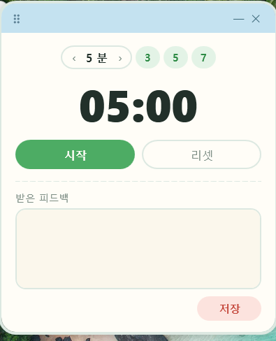

<!-- ⬆️ 위 --- 사이는 운영용 메모예요. 건드리지 말고 그대로 두세요. -->

# 헤이 자기소개 카드

- 닉네임: 헤이
- 하는 일:

---

## 🙋 자기소개

### 1. MBTI

> 제 MBTI를 몰라요. **혈액형 세대**예요 😅

### 2. 이것만큼은 자신 있어요

> **만들다 만 걸 끝까지 굴려보는 거**요.
>
> 아이디어보다 **"일단 돌아가는 상태까지 만들기"** 에 강합니다.

### 3. AI로 여기까지 해봤어요

> 아직은 **대화 많이 하고, 코드 조금 손댈 수 있는 수준**이에요.

### 4. 조에 기여하고 싶은 점

> 그냥 옆에서 응원하고, **오늘의 셸 잊지 않고 매일 보내드릴게요~**

### 5. 3기 기간 중 원하는 Before & After

**Before** — 지금 나는

> 어정쩡하게 지난 2기를 마쳤어요.

**After** — 3기 끝나고 나는

> **제가 만들고 싶은 프로덕트 하나를 완성해 보는 게** 목표예요.

---

## 📝 과제

> **1번과 2번은 굳이 오늘 완성하지 않으셔도 돼요.**
> 내일(23일) 18:30까지 과제 제출해 주시면 **셸 2개씩 지급** (조 내 100% 제출 시)

### 1. 오늘 구축한 GTM 코어 중 자랑하고 싶은 것

> 오늘 잡은 GTM 코어를 통째로 옮겨 적지 않으셔도 돼요.
> **가장 마음에 드는 한 조각**만 골라서 자랑해주세요.

### 2. 내가 만든 이기적 타이머 자랑하기

**발표 시간을 재면서, 받은 피드백을 그 자리에서 적어두는 작은 창**을 만들었어요.
줌이나 PPT 위에 계속 떠 있어서 발표하다가 창을 찾을 일이 없습니다.

시간 재는 건 원래 핸드폰으로도 되는데, 그때 들은 피드백은 늘 흩어졌어요.
**둘을 한 창에 두면 되지 않나** 싶어서 만들었습니다.

**켜는 법은 더블클릭 하나**

`타이머.bat` 을 더블클릭하면 끝이에요. 설치할 것도, 켜둘 서버도 없어요.
PowerShell로 만들어서 윈도우에 이미 있는 것만 씁니다.

**지금 되는 것**

- **줌 위에 계속 떠 있어요** — 화면 공유가 시작돼도 안 밀립니다
- 발표 시간은 **3 · 5 · 7분** 버튼 한 번, 또는 `‹ ›` 로 1분씩 (1~90분)
- **시작하면 시간 조절이 잠깁니다** — 발표 중에 실수로 건드리지 않게
- **소리 없이 색으로만 알려줘요**
  - 평소엔 연한 초록
  - **30초 남으면** 테두리가 호박색으로 천천히 숨쉬듯 반짝여요 (1.9초에 한 번)
  - **0:00** 이면 멈추고 코랄색으로 켜진 채 가만히 있습니다
- `—` 를 누르면 **시계만 남게 접혀요**. 발표에 집중할 때 쓰려고요
- 피드백은 `feedback‚6-08-22.md` 로 그날 날짜 파일에 쌓입니다
- 저장할 때 **시각이랑 `설정 5분 / 실제 06:12` 가 같이 기록돼요** — 내가 얼마나 넘기는지 보이라고
- **저장 안 누르고 창을 닫아도 알아서 저장됩니다**
- 두 번 더블클릭해도 창은 하나만 떠요

**정리는 앱이 안 해요**

쌓인 피드백은 날것 그대로 둡니다. 정리가 필요하면 클로드 코드에 `오늘 피드백 정리해줘` 하면
**좋았던 점 · 아쉬운 점 · 바꿔야 할 점**으로 나눠서 옆에 새 파일을 만들어줘요. 원본은 안 건드리고요.
앱이 다 하려고 하지 말고, 잘하는 애한테 넘기자는 생각이었습니다.

**제일 막혔던 순간**

**"항상 맨 위에 떠 있기"** 였어요.

창을 항상 위로 올리는 설정은 켰는데도, **줌이 화면 공유를 시작하면 타이머가 뒤로 숨어버렸습니다.**
발표 중에 정작 안 보이면 만든 의미가 없잖아요.

한참 헤매다 방향을 바꿨습니다. 한 번 올려두고 유지되길 바라는 대신,
**2초에 한 번씩 스스로 "나 맨 앞" 하고 다시 올라가게** 했어요.
밀려나도 2초 안에 되돌아옵니다.

한 방에 푸는 방법을 못 찾겠으면 **계속 되돌아오게 만드는 것도 답이더라고요.**

**다음에 붙이고 싶은 것**

- 발표자 이름 넣고 여러 명 연달아 진행하기
- 지난 피드백 한눈에 모아보기
- 소리 알림 켜고 끄기

일단 굴러가는 데까지만 만들었어요. **몇 번 써보고 진짜 불편한 것만 붙이려고 합니다.**

---
